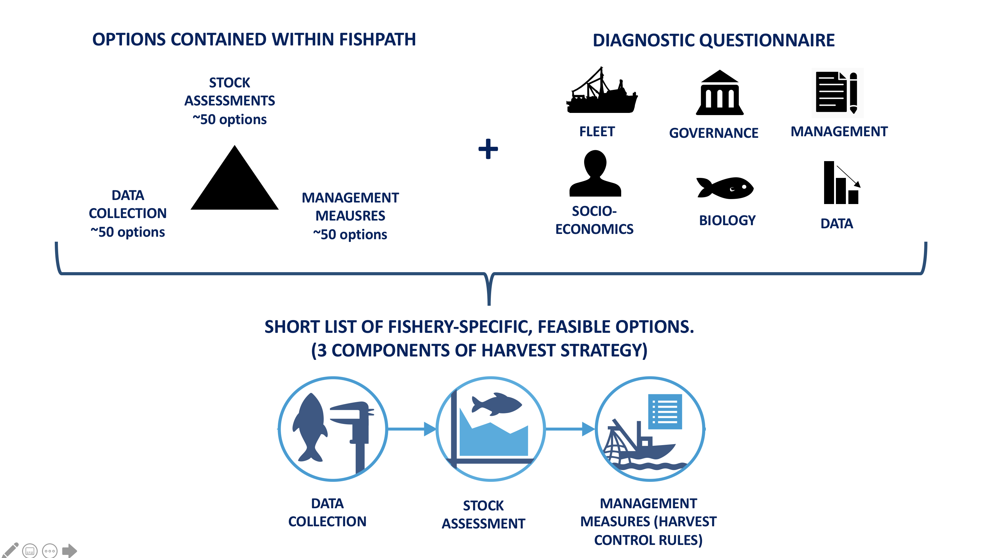

# Introduction {#intro}

## Motivation for Developing the FishPath Tool and FishPath Process {#motivation}
Sustainable fisheries management tends to be underpinned by harvest strategies that specify a predefined relationship among data collection programs, assessment methods, and management measures. However, only a small fraction of the world’s fisheries has these management systems in place, with resource- and data-limited fisheries facing significant challenges in their development. Notable recent progress has been achieved in the development of stock assessments and other data-limited tools, but outstanding challenges for data-limited fisheries lie in developing fully articulated harvest strategies, which includes determining, linking, and implementing appropriate options. Understanding the full suite of available data collection, stock assessment, and management measure options and choosing the options most appropriate for each fishery is an often-daunting process, given the full landscape of options. Exacerbating the challenge of numerous options, data-limited fisheries are often simultaneously capacity-limited. In addition, small-scale fisheries have unique characteristics and challenges, requiring unique and tailored plans, and where “silver bullet” approaches that do not fully consider the entire fishery’s unique challenges must be avoided. An enormous challenge lies in making fisheries technical information, resources, and harvest strategy support tools accessible, simple, and structured, while not oversimplifying the innate complexity and nuanced aspects of each individual fishery setting as to the detriment of the fishery and fishery participants. 

FishPath was developed as a collaboration between The Nature Conservancy (TNC), the U.S. National Oceanic and Atmospheric Administration (NOAA), and Australia’s Commonwealth Scientific and Industrial Research Organisation (CSIRO). FishPath is an approach for setting fisheries on the path to sustainability. The FishPath approach is something that everyone working in fisheries tries to do anyway — try and figure out what to do with what you have. It is simply a highly organized and inclusive way to do it and should be the entry point of any fisheries management development. 

FishPath includes a stakeholder engagement process which is underpinned by the FishPath tool. The FishPath process aims to engage stakeholders and build capacity to develop predefined fisheries harvest strategies that are tailored to local conditions and challenges. The FishPath tool supports the process of narrowing down and identifying viable components of the management strategy. However, the FishPath tool, while providing advice on narrowing the viable list of harvest strategy options, does not make the final selection or articulate the details of, evaluate, and implement the harvest strategy. It is strongly encouraged that users work with trained facilitators from the FishPath Coaches Network to facilitate this process and use resources found within the FishPath tool that identify appropriate tools for carrying out the harvest strategy.

## FishPath Tool Overview
The FishPath tool is an online decision-support tool that streamlines the process for identifying options for the 3 central components of a harvest strategy, specifically, the appropriate options for data collection programs, stock assessments, and management measures (or harvest control rules). 

To do this, FishPath tool users answer a series of multiple-choice questions regarding social, economic, operational, biological, ecological and governance characteristics of the fishery, including available data. User responses then flag key assumptions, considerations, and cautions for each option contained in the FishPath tool, which provides customized advice on the appropriateness of any option for the fishery of interest. The results section provides a guided process for narrowing down available options to a short list to be more formally considered for inclusion in a harvest strategy (\@ref(fig:overview)). Users can also learn about each option through details, resources and links within the tool.

It is important to understand what the FishPath tool does and does not do. First, the FishPath tool is not quantitative – it does not input, upload, or analyze data. The FishPath tool does not use an underlying model and is not a simulation or stock assessment tool. The FishPath tool does aid in the process of identifying a short list of viable options, but it does not prescribe a single, preferred option for each harvest strategy component. Rather, it encourages critical evaluation of an identified subset of options. The FishPath tool provides a standardized, transparent, and efficient platform for users to build the foundation of a harvest strategy for data-limited fisheries. The FishPath tool content undergoes continual updates to include the latest fisheries science and practitioner information. FishPath tool users may submit content suggestions at support@fishpath.org. 

```{r overview, echo=FALSE, fig.cap='The FishPath tool at a glance.', fig.align='center', out.width='75%', fig.show='hold'}

```

## Purpose and Intended Audience of the FishPath Tool User Guide
The purpose of the FishPath Tool User Guide is to orient users to the FishPath tool, explain the functionality of tool features, and provide succinct guidance on applying the tool to different fishery contexts. The FishPath Tool User Guide is for fishery practitioners interested in using the FishPath tool to select and review appropriate harvest strategy options. The ultimate goal is to embed the fully articulated harvest strategy within a Fishery Management Plan (outside the scope of the FishPath Tool User Guide). 

The FishPath tool is applicable in a variety of settings. Examples range from a large, inclusive FishPath stakeholder engagement where the tool is used in a multi-stakeholder setting, small expert groups, individual (“desktop”) use for harvest strategy development or review, and research related to individual components of a harvest strategy, such as selection of an assessment method or details about specific data collection or management measure options. The impact of the tool greatly depends on the context it is used, being most effective in a multi-stakeholder process and lead by experienced practitioners. The use of the tool can also be adapted to work with multi-species fisheries, multi-fleet fisheries, and in selecting current and future scenarios. Guidance on using the tool in these contexts will be incorporated into future versions of the user guide.  
