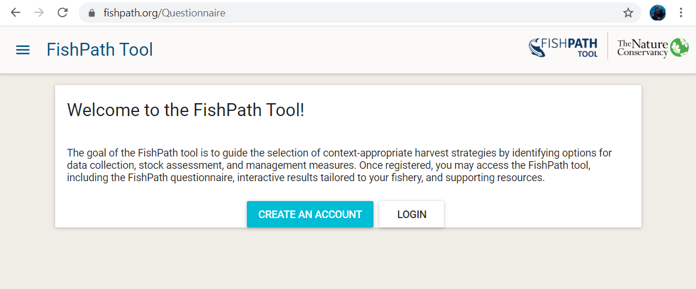
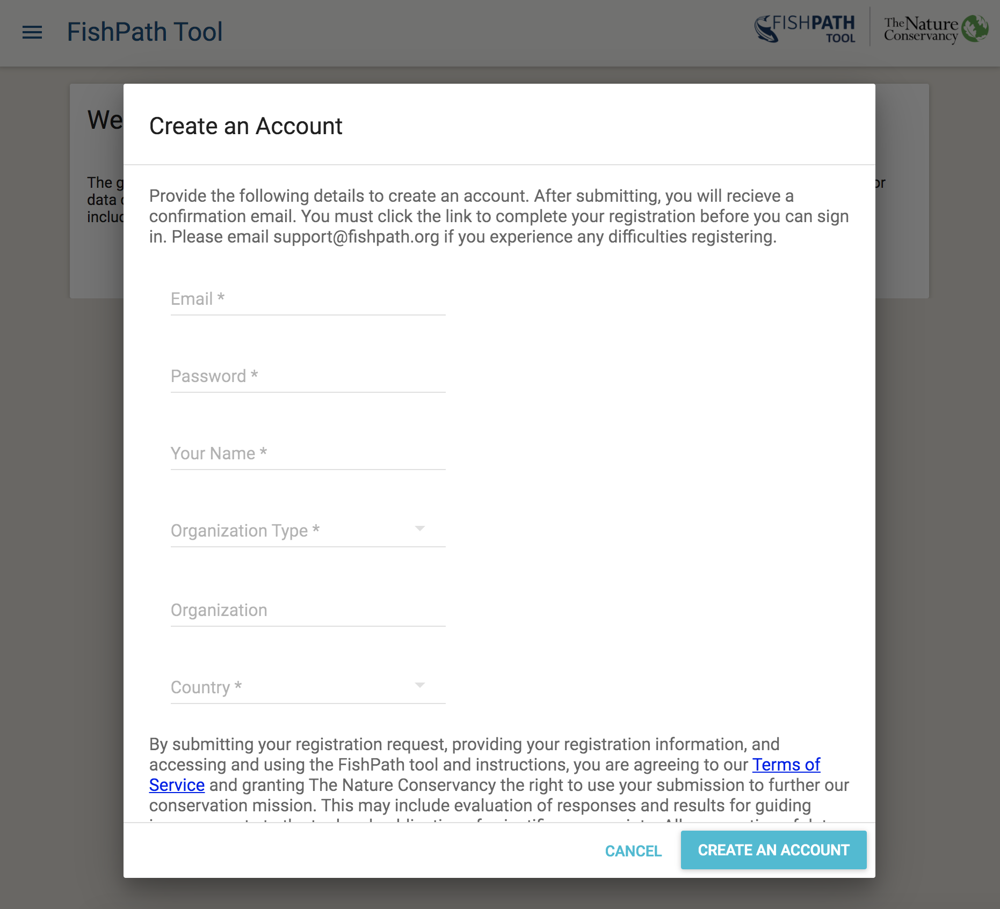
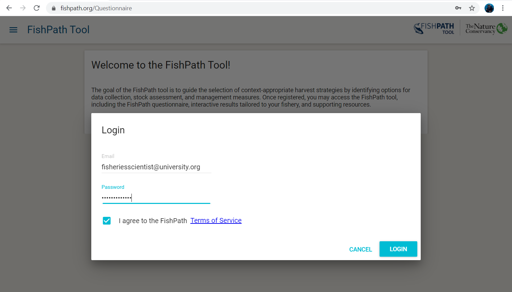
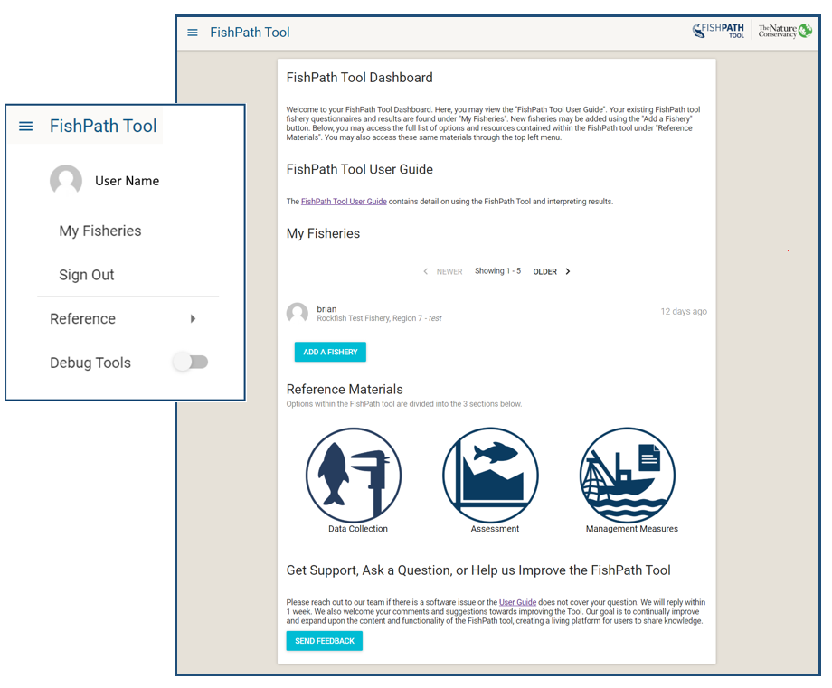
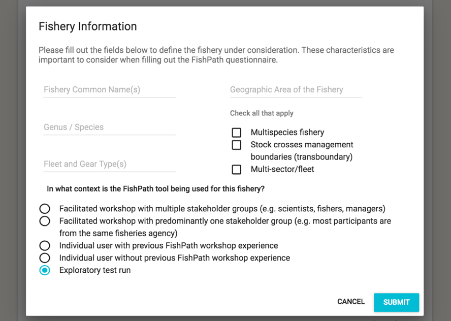
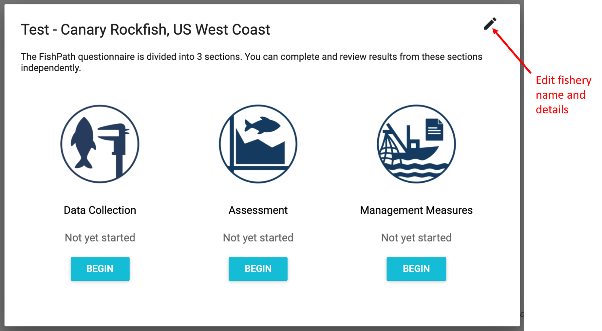

# Starting the FishPath Tool
Importantly, the FishPath tool requires a consistent internet connection to access the questionnaire, save answers, and interact with results.

## Welcome Page
When a user navigates to https://fishpath.org/, a welcome page is displayed with two prompts: “Create an Account” or “Login” (Figure \@ref(fig:welcome)).

```{r welcome, echo=FALSE, fig.cap='Welcome page of the FishPath tool.', fig.align='center', out.width='95%', fig.show='hold'}

```

## Creating a FishPath Account
Upon selecting “Create an Account”, a pop-up window appears with the following fill-in fields (Figure \@ref(fig:create-account)). An asterisk denotes mandatory information.

- Email\*
- Password\* (create a password)
- Organization Type\*
- Organization
- Your Name\*
- Country\*

Note that the email and password fields are case sensitive.

This information is used to track user origin and the use of the FishPath tool. At this account creation stage, the user is also prompted to read and accept the Terms of Service of the FishPath tool, developed by The Nature Conservancy ([Appendix B](#terms)).

```{r create-account, echo=FALSE, fig.cap='“Create an Account” screen of the FishPath tool.', fig.align='center', out.width='95%', fig.show='hold'}

```

After reading and accepting the Terms of Service, the user will be directed to their FishPath Tool Dashboard page. The user will receive a confirmation email of account creation.   After account creation, whenever the user returns to the Welcome Page of the FishPath tool, the user may simply “Login” with their email address and password (Figure \@ref(fig:login-page)).

```{r login-page, echo=FALSE, fig.cap='Login Page of the FishPath tool.', fig.align='center', out.width='95%', fig.show='hold'}

```

## FishPath Tool Dashboard
After creating an account (new user) or logging in (existing user), the user is directed to the FishPath Tool Dashboard (Figure \@ref(fig:dashboard)), or the user’s “homepage” of the FishPath Tool. On the FishPath Tool Dashboard, users view 4 headings:

1. **“FishPath Tool User Guide”**, which contains detail on using the FishPath Tool and interpreting results. 
2. **“My Fisheries”**, which provides a list of the user’s current list of fisheries they have started or completed in the tool. Users may access their fisheries at any time through this section, and return to in-progress FishPath questionnaires or results pages; 
3. **“Reference Materials”**, which provides a list of all options contained in the FishPath tool with details and reference materials;
4. **“Help us improve the FishPath Tool”**, which allows the user to send feedback to the FishPath team. 

```{r dashboard, echo=FALSE, fig.cap='FishPath Tool Dashboard, or the homepage for FishPath tool users. The pop out shows the FishPath Tool Dashboard drop-down menu.', fig.align='center', out.width='95%', fig.show='hold'}

```
When a user clicks the “FishPath Tool” menu in the top left corner, a drop-down display allows the user to navigate to various options (Figure \@ref(fig:dashboard)). The “Reference Materials” tab displays all of the options contained in the FishPath Tool.

## Adding a New Fishery
Selecting the blue button “Add a Fishery” allows users to start a new fishery in the FishPath tool that will be added to their account. First, a pop-up “Fishery Information” screen appears to prompt users to define the fishery of focus (Figure \@ref(fig:fishery-info)), using the fields below. This information is used to better understand the use of the FishPath tool, provide high-level aggregate information about fishery characteristics, and to help users define the fishery to which they will be applying FishPath, so that answers will be directed at that fishery only. Multi-species, multi-fleet and other more complicated fisheries can require special consideration when approaching the questionnaire (guidance will be added to this document at a later date).

-	Fishery Common Name(s):
-	Genus / Species:
-	Fleet and Gear Type(s):
-	Geographic Area of the Fishery: 
-	Check all that apply: Multispecies fishery; Stock crosses management boundaries (transboundary); Multi-sector/fleet
-	In what context is the FishPath Tool being used for this fishery?
    -	Facilitated workshop with multiple stakeholder groups (e.g. scientists, fishers, managers)
    -	Facilitated workshop with predominantly one stakeholder group (e.g. most participants are from the same fisheries agency) 
    -	Individual user with previous FishPath workshop experience
    -	Individual user without previous FishPath workshop experience
    -	Exploratory test run  

```{r fishery-info, echo=FALSE, fig.cap='The “Fishery Information” screen for adding a new fishery in the FishPath tool.', fig.align='center', out.width='95%', fig.show='hold'}

```
Upon selecting “Submit”, the user is prompted to select one of the 3 harvest strategy components (sections) of the FishPath Tool (Data Collection, Assessment, Management Measures) and begin the FishPath tool questionnaire (Figure \@ref(fig:fishery-entry)). Users can complete and review results from these sections independently. A pencil in the upper-right corner allows users to edit the fishery information (input in Figure \@ref(fig:fishery-entry)) at any time.

```{r fishery-entry, echo=FALSE, fig.cap='The “Fishery Information” screen for adding a new fishery in the FishPath tool.', fig.align='center', out.width='95%', fig.show='hold'}

```
