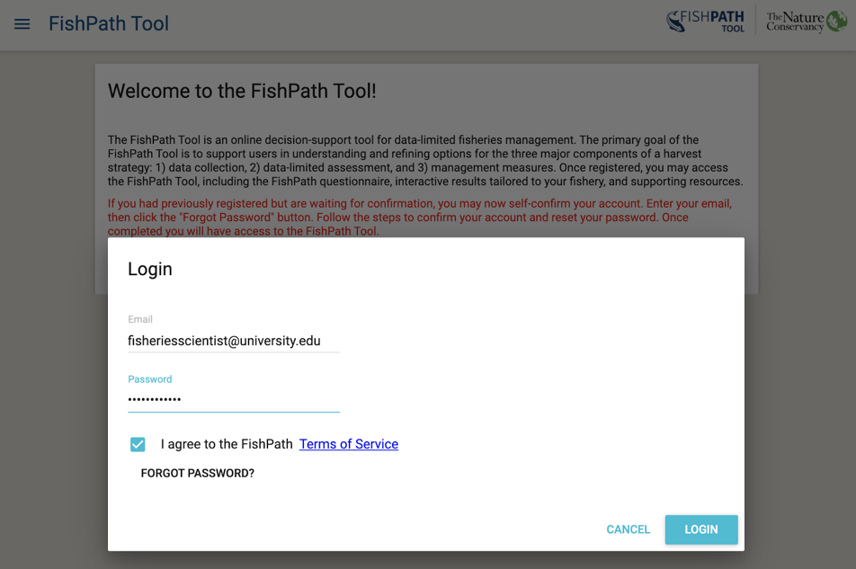
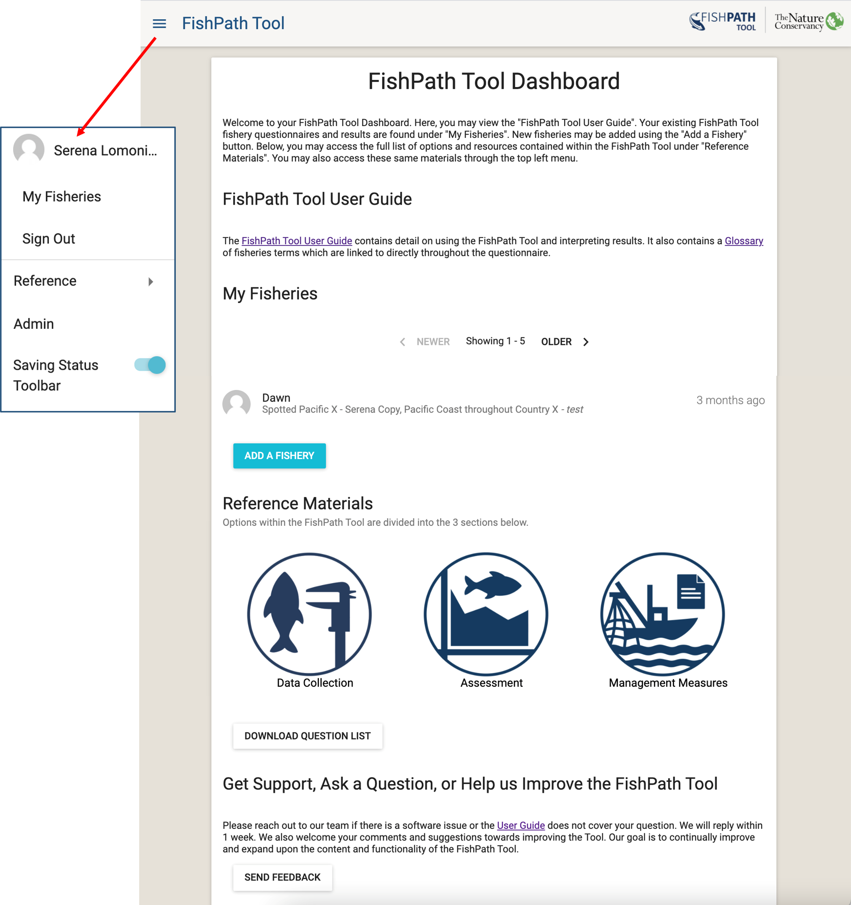
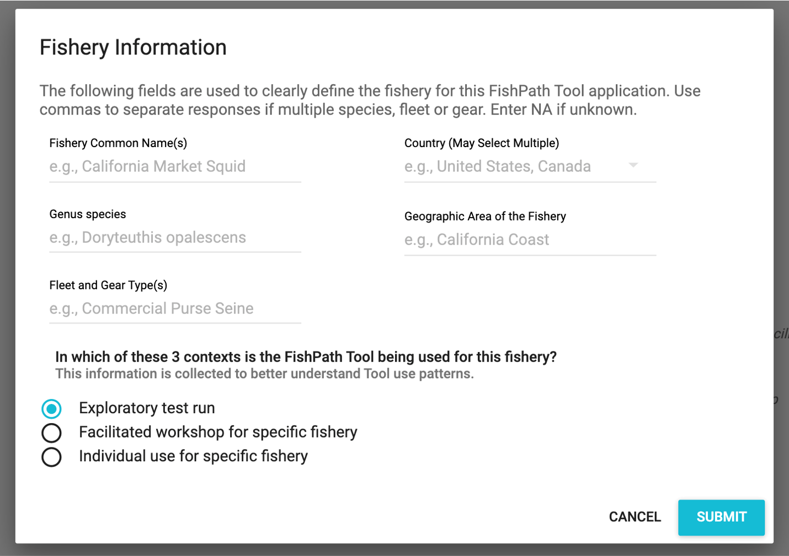

---
output:
  word_document: default
  html_document: default
---
# Starting the FishPath Tool
Importantly, the FishPath Tool requires a consistent internet connection to access the questionnaire, save answers, and interact with results.

## Welcome Page
When a user navigates to https://tool.fishpath.org/, a welcome page is displayed with two prompts: “Create an Account” or “Login” (Figure \@ref(fig:welcome)).

```{r welcome, echo=FALSE, fig.cap='Welcome page of the FishPath Tool.', fig.align='center', out.width='95%', fig.show='hold'}
knitr::include_graphics('images/welcome-page.png')
```

## Creating a FishPath Account
Upon selecting “Create an Account”, a pop-up window appears with the following fill-in fields (Figure \@ref(fig:create-account)). An asterisk denotes mandatory information.

- Email\*
- Password\* (create a password)
- Organization Type\*
- Organization
- Your Name\*
- Country\*

Note that the email and password fields are case sensitive.

This information is used to track user origin and the use of the FishPath tool. At this account creation stage, the user is also prompted to read and accept the Terms of Service of the FishPath tool, developed by The Nature Conservancy ([Appendix B](#terms)).

```{r create-account, echo=FALSE, fig.cap='“Create an Account” screen of the FishPath Tool.', fig.align='center', out.width='95%', fig.show='hold'}
knitr::include_graphics('images/create-account.png')
```

After submitting the account request, the user will automatically receive a confirmation email with a link to complete registration. After account creation, whenever the user returns to the Welcome Page of the FishPath Tool, the user may simply “Login” with their email address and password  (Figure \@ref(fig:login-page)).

```{r login-page, echo=FALSE, fig.cap='Login Page of the FishPath Tool.', fig.align='center', out.width='95%', fig.show='hold'}

```

## FishPath Tool Dashboard
After creating an account (new user) or logging in (existing user), the user is directed to the FishPath Tool Dashboard (Figure \@ref(fig:dashboard)), or the user’s “homepage” of the FishPath Tool. On the FishPath Tool Dashboard, users view 4 headings:

1. **“FishPath Tool User Guide”** (this guide), which contains detail on using the FishPath Tool and interpreting results. 
2. **“My Fisheries”**, which provides a list of the user’s current list of fisheries they have started or completed in the tool. Users may access their fisheries at any time through this section, and return to in-progress FishPath questionnaires or results pages; 
3. **“Reference Materials”**, which provides a list of all options contained in the FishPath Tool with details and reference materials, and the ability to download the Question List;
4. **“Get Support, Ask a Question, or Help us Improve the FishPath Tool”**, which allows the user to send questions or feedback to the FishPath team. 

```{r dashboard, echo=FALSE, fig.cap='FishPath Tool Dashboard, or the homepage for FishPath Tool users. The pop out shows the FishPath Tool Dashboard drop-down menu.', fig.align='center', out.width='95%', fig.show='hold'}

```

#### FishPath Tool Side Bar Menu
At the top left of the screen, users can view a drop-down side-bar menu by clicking the 3 horizontal lines (Figure \@ref(fig:dashboard)). This menu allows users to return to the Dashboard, Sign Out, access reference materials, and toggle functionality called “Saving Status Toolbar”. 

The “Saving Status Toolbar” (Figure \@ref(fig:saving-status)) will notify the user of the status of saving questionnaire responses and results. This toolbar appears at the bottom of the Questionnaire and results screens to notify the user if their changes have been saved to the database. If all changes have been fully saved, it will display “All Changes Saved”. In the event of inconsistent internet, changes may not save to the database immediately and status will be displayed (e.g., “Offline - 2 pending changes”). The Tool will keep attempting to save everything until successful. Users can continue answering the questionnaire or make other changes while changes are pending. However, users should not close or refresh the browser until all answers have been saved. If the browser is closed or refreshed before the save is complete, then those changes will be lost. The user will be notified that changes will be lost before closing or refreshing the page.

```{r saving-status, echo=FALSE, fig.cap='Saving Status Toolbar functionality. The top image shows saved; the bottom image shows changes pending.', fig.align='center', out.width='95%', fig.show='hold'}
knitr::include_graphics('images/saving-status-toolbar.png')
```

## Adding a New Fishery
Selecting the blue button “Add a Fishery” allows users to start a new fishery in the FishPath Tool that will be added to their account. A pop-up “Fishery Information” screen appears to prompt users to define the fishery of focus (Figure \@ref(fig:fishery-info)), using the fields below. This information helps users define the fishery to which they will be applying FishPath, so that answers will be directed at that fishery only. It is also used by TNC to better understand the use of the FishPath Tool and provide high-level aggregate information about fishery characteristics.

All fisheries and information saved in the Fishpath Tool (including questionnaire responses, notes, and results) are only accessible by the submitting user and FishPath Tool Admins. If desired, users may choose to [**share fishery results**](#Results-Actions).

-	Fishery Common Name(s):
-	Genus species:
-	Fleet and Gear Type(s):
- Country (may select multiple):
-	Geographic Area of the Fishery: 
-	In which of these 3 contexts is the FishPath Tool being used for this fishery? This information is collected to better understand Tool use patterns.
    -	Exploratory test run  
    -	Facilitated workshop for specific fishery
    -	Individual use for specific fishery


```{r fishery-info, echo=FALSE, fig.cap='Fishery Information pop-up screen of the FishPath Tool.', fig.align='center', out.width='95%', fig.show='hold'}

```

Upon selecting “Submit”, the user is prompted to select one of the 3 harvest strategy components (sections) of the FishPath Tool (Data Collection, Assessment, Management Measures) and begin the FishPath tool questionnaire (Figure \@ref(fig:fishery-entry)). Users can complete and review results from these sections independently and in any order. A pencil in the upper-right corner allows users to edit the fishery information (input in Figure \@ref(fig:fishery-entry)) at any time.

```{r fishery-entry, echo=FALSE, fig.cap='Entry screen to the FishPath Tool questionnaire after fishery information has been defined. The pencil icon (red arrow) allows users to edit fishery name and details.', fig.align='center', out.width='95%', fig.show='hold'}
knitr::include_graphics('images/fishery-entry-screen.png')
```
