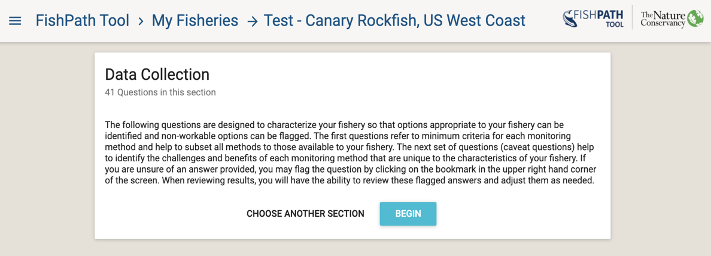
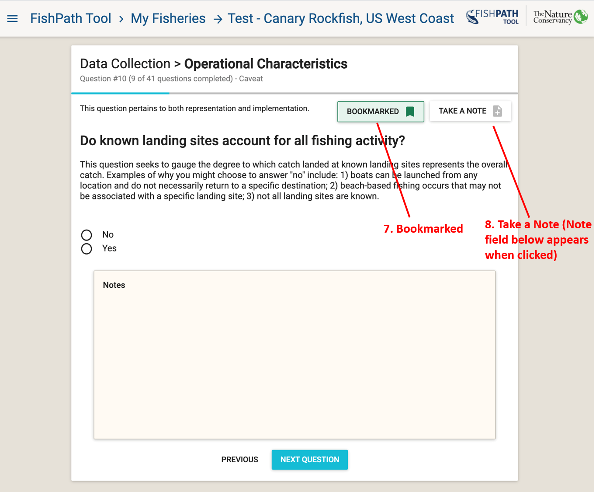

# FishPath Tool Questionnaire

The goal of the FishPath Tool questionnaire is to elicit information about all aspects of the fishery. This information leads to the activation of assumptions, cautions and considerations for each option. Across the three sections (Data Collection, Assessment, and Management Measures) the user answers a series of ~120 questions. Questions are categorized in 6 categories, which indicate the nature of the information in the question:

1. Biology/Life History
2. Data Availability
3. Governance
4. Management 
5. Operational Characteristics
6. Socio-Economic

Some questions are relevant to multiple sections (Data Collection, Assessment, Management Measures). Once answered, these will not appear in any subsequent section in which they occur. For more information on how questions that cross multiple sections are displayed, please see [this FAQ below](#faq-question-numbering).

At any time, the user may close and later return to their session via their “My Fisheries” dashboard. Once the user has completed an individual section, the user may either complete a subsequent section or view results from the completed section. Results for any section become available once the user has completed the respective questionnaire section. 

After viewing the entry screen to the FishPath questionnaire (Figure \@ref(fig:fishery-entry)), the user selects one of the 3 sections. An overview screen will appear with the name of the section, the number of questions associated with that section, and a short guidance on answering the questions (Figure \@ref(fig:dc-overview)). The user can then choose to “Begin” the section or “Choose Another Section”.

```{r dc-overview, echo=FALSE, fig.cap='Data Collection section overview.', fig.align='center', out.width='95%', fig.show='hold'}

```

## Anatomy of a FishPath Tool Question
Figures \@ref(fig:question-anatomy) and \@ref(fig:bookmark-notes) show examples of the FishPath Tool question screen.

 ```{r question-anatomy, echo=FALSE, fig.cap='Anatomy of a FishPath Tool question.', fig.align='center', out.width='95%', fig.show='hold'}
knitr::include_graphics('images/question-anatomy.png')
```

1.	At the top of the screen, the **section** is shown (either Data Collection, Assessments, or Management Measures). 
2.	The section is followed by the **question category** (i.e., Biology/Life History, Data Availability, Governance, Management, Operational Characteristics, or Socio-Economic). 
3.	A sub-heading identifies whether the question is a **“criteria” or a “caveat”** question.
4.	The sub-heading also indicates the **number of questions answered** and remaining within that section. 
5.	For the Data Collection section only: This notifies users whether the question has ramifications for the ability to collect representative data, or pertains to the ability to implement a data collection program, or both. It is simply intended to help the user better understand and answer the question.
6. Toggle between **“Previous”** and **“Next Question”**. At the bottom of the screen, the user may advance to the next question or return to the previous question.
7.	There is the ability to **“Bookmark”** the question. A bookmark flags questions for ease of later revisiting (Figure \@ref(fig:bookmark-notes)). A question may be bookmarked for reasons such as if the answer is unknown, it needs further consideration or input, is in dispute, or if the user feels the question is critical. As all questions must be answered in order to review results, adding a bookmark allows users to provide an interim response that may be revisited in the results section, once the user can evaluate the relative impact of their response.
8.	Users can **“Take A Note”** on a question (Figure \@ref(fig:bookmark-notes)). Notes can be taken for a variety of reasons such as to clarify why a certain response was given, to capture important discussion about a question, why the question was bookmarked or noting a response requiring further research. Notes can later form an important part of draft harvest strategy development, and, by providing justification for the response, can maintain traceability and replicability. When connected to the internet, all notes made will be saved into the FishPath Tool and available to the user for reference.


 ```{r bookmark-notes, echo=FALSE, fig.cap='Example FishPath Tool question with “Bookmark” (green) and “Take a note” (text box) functionality selected.', fig.align='center', out.width='95%', fig.show='hold'}

```

## Criteria and Caveat Questions
Questions are designated as either “Criteria” or “Caveats” or both, which refers to how question responses are linked to options contained within the FishPath Tool.

A Criterion question is used to determine whether the fishery meets a minimum qualification required to apply an option. Questions whose responses invoke “caveats” will not eliminate options, but rather invoke traffic light-colored warnings (red, yellow, orange), or positive attributes (green), against specific options.


## Subjective Questions

While the majority of questions within the FishPath Tool are intended to be answered definitively (objective), certain questions are subjective in nature. For example, a subjective question may ask to rank certain fishery characteristics on a qualitative scale (e.g., “low”, “moderate”, “high”). This subjective design is intentional, as it allows users to think through key, relative characteristics of their fishery that will influence the feasibility of implementing certain management options.

Generally, the best approach to take when completing the questionnaire is to aim to do so relatively efficiently, without overly laboring or debating over any one question. If in doubt, the question can be bookmarked, and notes can be taken, for easy revisiting later. The transparency of the FishPath Tool allows users to explicitly see how their response to any one question influences the results (by invoking criteria or caveats), and to [**readily change their answer if desired**][Bookmarked Questions and Influential Answers]. Moreover, the aim of the questionnaire is to obtain an overall profile of the fishery’s characteristics to best inform the choice of harvest strategy option. As such, questions may pertain to only a few options, or they may not invoke strong caveats. The goal is to appraise the fishery as a whole, as opposed to focusing on any single question.

## Completing the Questionnaire
Upon completing or exiting any of the three sections, a pop-up summary window appears with the questionnaire status (Figure \@ref(fig:summary-screen)). Users may review their results for completed sections, or otherwise continue the questionnaire.

The questionnaire is periodically updated by the FishPath team to reflect the latest fisheries science. If there are any new or outstanding questions, the section will no longer display as “Complete” in the pop-up summary window (Figure \@ref(fig:summary-screen)) when returning to a fishery questionnaire. Instead, the number of new questions needing to be answered will be displayed (e.g., “45 of 46 questions answered”). For more information on questionnaire updates, please see [this FAQ below](#faq-content-updates).

 ```{r summary-screen, echo=FALSE, fig.cap='Summary window of the 3 FishPath Tool questionnaire sections, showing questionnaire progress.', fig.align='center', out.width='95%', fig.show='hold'}
knitr::include_graphics('images/summary-screen.png')
```

## FishPath Tool Conceptual Framework
At a high level, the FishPath Tool is a framework that “matches” the user’s questionnaire responses with the 150+ options contained within the Tool (Figure \@ref(fig:conceptual)). In other words, the user’s answers to the questions help characterize the fishery. Each answer is used to flag considerations when applying a given option to the fishery. These considerations (and types of questions) may take two forms. Criteria denote that the fishery does or does not meet the basic requirements to undertake an option. Alternatively, caveats are warnings to consider when applying the option. Caveats may either be scaled intensity warnings denoted by traffic light colors, or static caveats which always apply to the option. 

 ```{r conceptual, echo=FALSE, fig.cap='High level, conceptual framework of the FishPath Tool, demonstrating the linkages between questions, options, and criteria or caveats.', fig.align='center', out.width='95%', fig.show='hold'}
knitr::include_graphics('images/conceptual-framework.png')
```

### FishPath Tool: Framework Overview of the 3 Sections 

#### Data Collection Section

The Data Collection section of the FishPath Tool aims to support the user in understanding which broad categories of information to collect, as well as the data collection mechanisms that are best suited for the fishery context, capacity, and realities of on-the-ground implementation. 

There are a range of data collection mechanism options (from market surveys, to logbooks and observer programs) in the FishPath Tool. These options are subdivided according to the broad category of information that may be collected, as these influence the viability of the data collection option. The [**four data categories**][Data Categories] in the FishPath tool are: 1) data that yield a basic understanding of the fishery; 2) biological information; 3) data that can inform temporal trend analyses (data time series), and 4) data that are of a sufficient quality to inform a model-based stock assessment.

#### Assessment Section

The Assessment section of the FishPath Tool allows the user to understand which data-limited stock assessment approaches are available and best suited to their fishery. In the FishPath Tool, an assessment is defined as any analysis or performance indicator that gives useful information for management by direct or indirect measures of stock status. This could range from a “cause for concern” arising from expert judgement, qualitative risk assessments, values of empirical indicators relative to pre-defined trigger levels, multiple indicator frameworks, to life history analyses that provide estimates of fishing mortality, (F), or fishing mortality at maximum sustainable yield,  (FMSY), catch-only models, size or length based approaches, to population dynamics model-fitting approaches that estimate biomass.

Based on the fishery characteristics and the quality and type of available data (elicited from the questionnaire), user responses flag caveats and raise criteria against the [**assessment options**][Assessment Categories]. 

#### Management Measure Section

In the FishPath Tool, the Management Measures section allows users to review and refine appropriate options for managing fishing mortality. [**Management measure options**][Management Measure Categories] within the FishPath Tool can take many forms including spatial, temporal, effort, catch, and gear related restrictions. The FishPath Tool does not have any minimum criteria listed for management measures, but instead uses cautionary caveats. Multiple management measures can and should be used together. The FishPath Tool results do not prescribe or give guidance on the specific form of the harvest rule, nor the strength of adjustment in response to assessment outcomes. However, the FishPath Tool does direct users to resources and tools that can support this process, located within the description of each option.