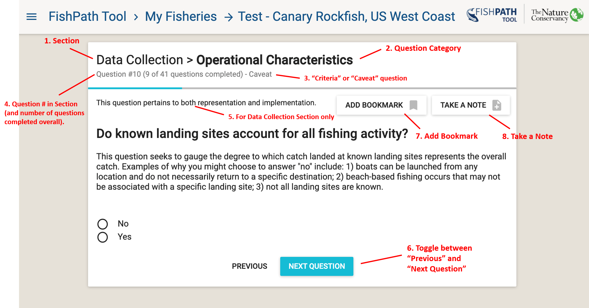

# FishPath Tool Questionnaire

The goal of the FishPath tool questionnaire is to elicit information about all aspects of the fishery. This information leads to the activation of assumptions, cautions and considerations for each option. Across the three sections (Data Collection, Assessment, and Management Measures) the user answers a series of ~110 questions. Questions are categorized in 6 categories, which indicate the nature of the information in the question:

1. Biology/Life History
2. Data Availability
3. Governance
4. Management 
5. Operational Characteristics
6. Socio-Economic

Some questions span multiple sections of the questionnaire (i.e. they are relevant in considering multiple components of a harvest strategy). To avoid duplicity, such questions, once answered, will show as completed when beginning any subsequent section in which they occur. 

At any time, the user may close and later return to their session via their “My Fisheries” dashboard. Any submitted answers will be saved with a consistent internet connection. Once the user has completed an individual section, which may only be achieved by providing responses to all questions in that section, the user may either complete a subsequent section or view results from the completed section. Results for any section become available once the user has completed the respective questionnaire. The questionnaire is periodically updated by the FishPath team to reflect the latest fisheries science, so users may need to answer any new questions when returning to a fishery before reviewing results of associated sections.

After viewing the entry screen to the FishPath questionnaire (\@ref(fig:fishery-entry)), the user selects one of the 3 sections. An overview screen will appear with the name of the section, the number of questions associated with that section, and a short guidance on answering the questions (\@ref(fig:dc-overview)). The user can then choose to “Begin” the section or “Choose Another Section”. 

```{r dc-overview, echo=FALSE, fig.cap='Data Collection section overview.', fig.align='center', out.width='95%', fig.show='hold'}
knitr::include_graphics('images/dc-overview.png')
```

## Criteria and Caveat Questions
In the FishPath tool, questions are designated as either “Criteria” or “Caveats” or both, which refers to how question responses are linked to options contained within FishPath. 

A Criterion question is used to determine whether the fishery meets a minimum qualification required to apply an option. Whether the fishery meets the minimum (or often multiple) criteria for each option is indicated in the results window (see Results sections below). For example, in the “Assessment” section of the questionnaire, there are questions about data quality, quantity, and data type for the fishery, which correspond to the minimum levels required to enable each type of assessment method. Upon answering a “criteria question” about, for example, fishing effort data, within the Assessment section (\@ref(fig:ex-crit-question)), the fishery will be scored in the results section according to whether it meets that particular minimum level of effort data required by particular assessment options. The Results section reports not only whether or not each criterion is met, but also gives an indication, via subjectively assigned traffic light color scales, as to the degree the criteria is met, and provides guidance as to the level of uncertainty associated with that particular required input. Criteria questions are not included in the “Management Measures” section. While a management measure option may be ill-advised because it violates assumptions (i.e, “caveats”), there are no prohibiting factors that would prevent any single option being implemented, if so desired. Conversely, one cannot undertake certain assessments or forms of data collection without meeting minimum requirements. 

Questions whose responses invoke “caveats” will not eliminate or retain options, but rather invoke subjectively assigned traffic light-colored warnings, or positive attributes, against specific options. These are intended to speak to issues that do not necessarily prohibit the option’s feasibility, but that should be given explicit consideration, and the ability to address each should be determined, before deeming the option is best suited to the fishery. As with the criteria questions, these are presented in the results section of the FishPath tool with explanatory text.
 
 ```{r ex-crit-question, echo=FALSE, fig.cap='Example “criteria” question in the Assessment section of the FishPath Questionnaire.', fig.align='center', out.width='95%', fig.show='hold'}
knitr::include_graphics('images/ex-crit-question.png')
```

## Anatomy of a FishPath Tool Question
(\@ref(fig:question-anatomy)) provides an example of a FishPath question screen:

1.	At the top of the screen  , the **section** is shown (either Data Collection, Assessments, or Management Measures). 
2.	The section is followed by the **question category** (i.e., Biology/Life History, Data Availability, Governance, Management, Operational Characteristics, or Socio-Economic). 
3.	A sub-heading identifies whether the question is a **“criteria” or a “caveat”** question.
4.	The sub-heading also indicates the **number of questions answered** and remaining within that section. 
5.	For the Data Collection section only, it is also stated whether the question pertains to either issues of **“representation” or “implementation”**. This helps users to understand the intent of the question, by identifying whether the question has ramifications for the form of data collection in terms of its either ability to obtain representative data, or in its ability to be effectively implemented. 
6.	There is the ability to **“Bookmark”** the question A bookmark flags questions for ease of later revisiting (\@ref(fig:bookmark-notes)). A question may be bookmarked for reasons such as if the answer is unknown, it needs further consideration or input, is in dispute, or if the user feels the question is critical. As all questions must be answered in order to review results, adding a bookmark allows users to provide an interim response that may be revisited in the results section, once the user can evaluate the relative impact of their response. 
7.	Users can **“Take A Note”** on a question (\@ref(fig:bookmark-notes)). Notes can be taken for a variety of reasons such as to clarify why a certain response was given, to capture important discussion had about a question, why the question was bookmarked or noting a response requiring further research. Notes can later form an important part of draft harvest strategy development, and, by providing justification for the response, can maintain traceability and replicability. When connected to the internet, all notes made will be saved into FishPath and available to the user for reference. 
8.	At the bottom of the screen, the user may advance to the **next question** or return to the **previous** question. 

 ```{r question-anatomy, echo=FALSE, fig.cap='Anatomy of a FishPath tool question.', fig.align='center', out.width='95%', fig.show='hold'}

```

 ```{r bookmark-notes, echo=FALSE, fig.cap='Example FishPath tool question with “Bookmark” (green) and “Take a note” (text box) functionality selected.', fig.align='center', out.width='95%', fig.show='hold'}
knitr::include_graphics('images/bookmark-notes.png')
```

## Subjective Questions

While the majority of questions within FishPath are intended to be answered definitively (objective), certain questions are subjective in nature. The latter typically request a user response in the form of a perceived ranking (e.g. “low”, “moderate”, “high”). Most such questions invoke caveats and, when all caveats are considered together, the relative impact of those invoked by subjective questions can be evaluated. In this way, priority can be assigned to whether the response requires further consideration and debate, or whether it is of little relative significance in determining the most viable harvest strategy options. Further discussion can then be focused on the most appropriate issues.

Generally, the best approach to take when completing the questionnaire is to aim to do so relatively efficiently, without overtly laboring or debating over any one question. If in doubt, the question can be bookmarked, and notes can be taken, for easy revisiting later. The transparency of the FishPath tool is such that users will be able to see explicitly how their response to any one question influences the results (by invoking criteria or caveats), and to readily change their answer if so desired   . Moreover, the aim of the questionnaire is to obtain an overall profile of the fishery’s characteristics, so as best to inform the choice of harvest strategy option. As such, questions may pertain to only a few options, or they may not invoke strong caveats. The goal is to appraise the fishery as a whole, as opposed to myopically focusing on any single question.

## Completing the Questionnaire
Upon completing or exiting any of the three sections, a summary screen appears with the status of relative completion. Users review their result for completed sections, or otherwise continue the questionnaire (\@ref(fig:summary-screen)). 

 ```{r summary-screen, echo=FALSE, fig.cap='Summary window of the 3 FishPath questionnaire sections, showing questionnaire progress.', fig.align='center', out.width='95%', fig.show='hold'}
knitr::include_graphics('images/summary-screen.png')
```