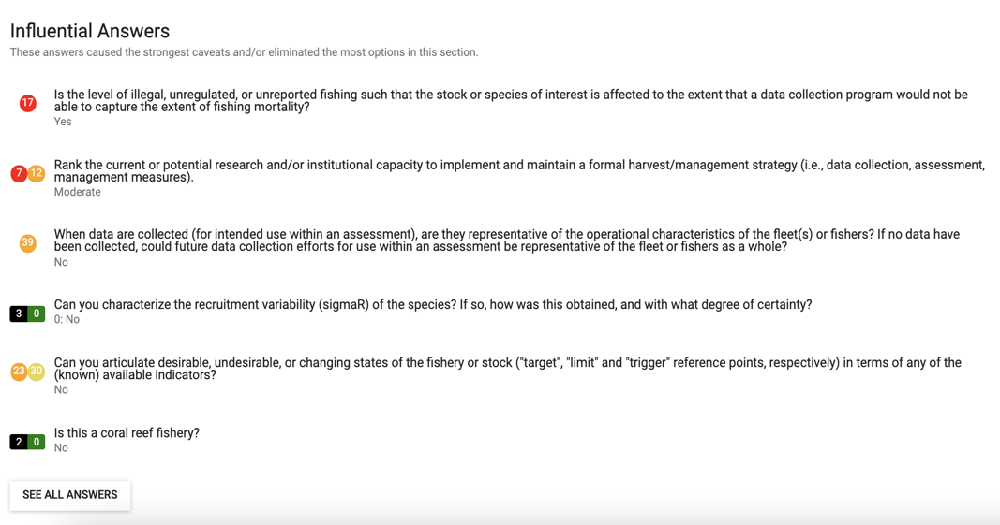
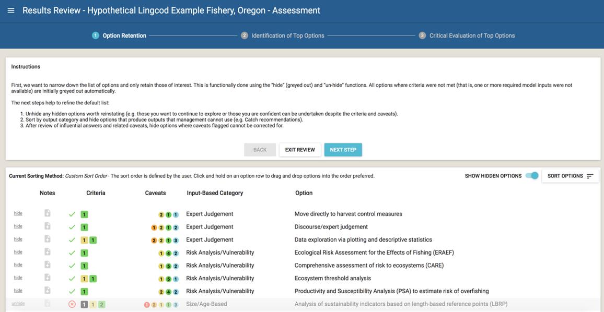

# FishPath Tool Interactive Results Page

The FishPath Tool Interactive Results Pages allow users to view and interact with all of the options contained within FishPath and understand how each option may apply to their fishery.

Upon completion of the questionnaire for any section, the user is directed to the FishPath Tool Interactive Results page (Figure \@ref(fig:results-overview)). The results are presented separately for each of the 3 sections, or harvest strategy component: 1) Data Collection; 2) Assessment; and 3) Management Measures (Figure \@ref(fig:results-overview), see arrow). 

Each of the three sections of the results can be accessed individually without needing to complete all three sections. If a user has not completed the questionnaire in at least one of the sections, they will be prompted to return to finish the section questionnaire before accessing results (Figure \@ref(fig:summary-screen)).

In this section, users should first begin with the process to “Narrow your Results” (Figure \@ref(fig:results-overview), blue button). Below, the layout and functionality of this screen is explained, followed by steps in the results narrowing process.

```{r results-overview, echo=FALSE, fig.cap='Initial results display screen in the FishPath Tool (featuring the Assessment section in the red box), displaying a snapshot of results, not a full listing.', fig.align='center', out.width='95%', fig.show='hold'}
knitr::include_graphics('images/results-overview.png')
```

Figure \@ref(fig:results-components) shows the general components of the results page. Each of these is elaborated below: 

1.	[Interactive Results Table]
2.	[Show Hidden Options and Sort Options] 
3.	[Bookmarked Questions and Influential Answers]
4.	[Results Narrowing Process]
5.	[Actions to Share Results and Edit Fishery Info]
6. [View-Only Mode (Shared Fishery)]

```{r results-components, echo=FALSE, fig.cap='Key components (red labels 1-5) of the FishPath Interactive Tool Results Page.', fig.align='center', out.width='95%', fig.show='hold'}
knitr::include_graphics('images/results-components.png')
```

## Interactive Results Table
The results table lists all the available options for the selected section. Each row represents one option (Figure \@ref(fig:result-rows)) and summarizes the criteria met and failed, the caveats invoked, and other details. Each option can be selected and expanded to view its description and full caveats and criteria. Each component of the row is explained below.

```{r result-rows, echo=FALSE, fig.cap='Headings of the FishPath Tool results table (bold black text) and 3 example options (3 rows). This is the Assessment section.', fig.align='center', out.width='95%', fig.show='hold'}
knitr::include_graphics('images/results-rows.png')
```

### Table Structure

- **Hide/Unhide:** Any option for which one or more of its minimum criteria have not been met by the fishery is automatically “hidden” (greyed-out) by the FishPath Tool (Figure \@ref(fig:hide)). For any option, including those not meeting minimum criteria, users may manually click this link to “hide” the option, or click “unhide” to reinstate it. Hidden options are only shown when the toggle “Show Hidden Options” is on (red label 2 in Figure \@ref(fig:results-components)) 

```{r hide, echo=FALSE, fig.cap='Hide, unhide buttons', fig.align='center', out.width='10%', fig.show='hold'}
knitr::include_graphics('images/hide.png')
```

- **Notes:** As within the questionnaire, notes may be written and saved for each option by clicking on the note icons (Figure \@ref(fig:notes)). For example, notes may be taken on fishery-specific details on why that option may or may not be a good fit, or to record the user’s or user groups overall evaluation of the option, given its associated criteria and caveats. Alternatively, notes may be taken if options are hidden or reinstated, to justify that choice as documentation. Notes can be included in the PDF report.

```{r notes, echo=FALSE, fig.cap='Top icon shows an option with a note already taken. Click to view or edit the note. The bottom icon signifies that no note has been taken for the option. Click to create a new note.',fig.align='center', out.width='15%', fig.show='hold'}
knitr::include_graphics('images/notes.png')
```

- **Criteria (Data Collection and Assessment sections only):** The criteria column provides information on whether the fishery meets the minimum conditions required to undertake the option. If the fishery has met all of the minimum criteria required for an option, a green check is displayed. On the other hand, if a fishery has not met one or more of the minimum criteria required for an option, it is considered to be eliminated, a red X is displayed, and the option is automatically “hidden”. 

  In the Data Collection section, criteria are either “Not Met”or “Met” (Figure \@ref(fig:dc-criteria)). In an eliminated option row,  black boxes indicate the number of minimum criteria that were not met. Green boxes indicate the number of criteria that were met.


```{r dc-criteria, echo=FALSE, fig.cap='Example of data collection criteria icons. The top row shows an option that has been eliminated, signified by the red X. It was eliminated due to 1 of the 4 criteria not meeting the minimum requirement. The bottom row shows an option that passed, signified by the green check. The option met both of its criteria requirements.', fig.align='center', out.width='35%', fig.show='hold'}
knitr::include_graphics('images/dc-criteria.png')
```

<ul> <li style="list-style-type: none;">
In the Assessment section, criteria are also either “Not Met” or “Met” (Figure \@ref(fig:a-criteria)). In addition, the “Met” criteria have “traffic light” colors (red, orange, yellow, green) associated with them. The colors  represent the quality of each data type and encourage FishPath users to explicitly consider the uncertainty associated with using this data in assessments. For example, say there is a time series of removals for the fishery, but it is missing the removal data from an important fleet. The answer for this question will reflect this bias. Then in the assessment results, options requiring a time series of removals (of any quality) will display that this criterion was met, but it will be colored orange to signify that there is high uncertainty in the removal data. This is a reminder that the user needs to be aware of this uncertainty when performing the assessment and interpreting the results.

The number of “Not Met” criteria for each option is shown in the black box, while “Met” criteria corresponding to each color of uncertainty levels are shown in the colored boxes. In other words, the number in the black box represents the number of criteria that are “Not Met”, while summing the numbers within each colored box equal the total number of criteria that have been “Met”.
</li></ul>

```{r a-criteria, echo=FALSE, fig.cap='Example assessment criteria icons. The top row shows an option that has been eliminated due to 3 criteria that did not meet the minimum requirement. These failed criteria are signified by the 3 in the black box. The bottom row shows an option that has passed criteria, signified by the green check. For both rows, each traffic light color shows the number of passing, or “Met”,  criteria at the various strengths of warning about the data uncertainty.', fig.align='center', out.width='35%', fig.show='hold'}
knitr::include_graphics('images/a-criteria.png')
```

- **Caveats:** The format of the caveats column is identical across all three sections (Figure \@ref(fig:caveats)). Caveats are shown as colored circles with numbers indicating the total number of questionnaire responses that invoked a caveat of that particular color. There are three types of caveats:

  1.	**Cautionary, or warning caveats:** These are marked as red, orange, and yellow circles with the severity or strength of the caveat corresponding to the color (red being highest). These give cautionary guidance based on an attribute of a fishery. For example, if the user responded that the species of interest is susceptible to barotrauma, this would invoke a red caveat against size limits as a management measure, since the fishing-induced mortality of the released (under- or over-sized) fish would render size limits ineffective.
  2.	**Positive attributes:** A green colored caveat provides reasoning for why the option might be well-suited for the fishery on the basis of the questionnaire responses.
  3.	**Static caveats:** Light blue colored caveats are static caveats that need to be considered for an option, regardless of the fishery or the questionnaire responses. A static caveat is independent of specific fishery circumstances and as such is always present. These include key assessment assumptions, for example, that the assessment option assumes that fishery selectivity has not changed over time, or that the assessment method cannot explicitly address uncertainty.

```{r caveats, echo=FALSE, fig.cap='Example of the number of warning caveats (traffic light colors), positive attributes (green), and static caveats (light blue) flagged for an option.', fig.align='center', out.width='35%', fig.show='hold'}
knitr::include_graphics('images/caveats.png')
```

- **Category:** The Category column allows the user to view the options by categories and is different for each section.

  - ##### Data Categories
  In the **Data Collection Section**, the “Data Category” column shows the four categories of data that may be collected.
    a. **Basic understanding of the fishery.** When very little is known about a fishery, stakeholders may want to start by collecting general fishery information or fishery operational characteristics to gain a basic understanding of it. Where very few resources are available, this may be the only available data type, although efforts should be made to move beyond this and make the most efficient use of available capacity. Information collected can be fishery independent or dependent; it can help stakeholders learn more about the size and composition of the fleet, identify the total fished area, determine the gear types used, identify the species landed, make broad estimates regarding catch or fishing effort, and gather other information to aid in better understanding the fishery.
    b. **Temporal trend analyses (data time series).** Data collected for trend analyses are used to track temporal patterns in fishery performance indicators (e.g., catch, fishing effort, catch-per-unit-effort, and catch composition by species), ecosystem indicators, and species biology indicators. In the absence of biomass estimates, temporal trends of other performance indicators can be used for monitoring the health of the fishery over time. Data for trend analyses must be collected at regular, consistent intervals, and must ideally be directly comparable (i.e., collected using the same gear, from approximately the same spatial regions).
    c. **Biological information.** Biological data are collected by obtaining a sample or samples from the species population, recording biometric information (e.g., length/size and weight), gathering information on sex and maturity (e.g., sex identification and maturity identification), and/or collecting biological samples for further study (typically those that are age-related, such as otoliths, scales, and teeth). Biological data provide key information on the species’ life history traits, such as growth and reproduction rates. These data are used to better understand the fish stock and to provide the parameters used within fisheries stock assessments and models aiming to estimate the status of the stock.
    d. **To inform model-based stock assessment.** Stock status is estimated via formal (model-based) stock assessments. A stock assessment provides an indicator (or proxy) for the current status of the stock, which can then be compared with a selected reference point. Reference points are the benchmarks used to indicate if the stock is in a desirable or an undesirable state. As opposed to the “Temporal trend analyses” category, data collected here inform a quantitative assessment that yields an estimate of biomass or fishing mortality, and the category refers to reliable, detailed data. Data collected to measure the stock status (or proxy) can include reliable time series of catch, fishing effort, catch-per-unit-effort, length compositions, weight compositions, fishery-dependent density, or fishery-independent abundance. Most assessment methods require that any biological sampling undertaken to inform biological parameters should occur prior to, or in conjunction with, data collection efforts to establish reference points.
  - ##### Assessment Categories
  In the **Assessment Section**, there are two types of categories for each option, the “**Assessment Category**” and “**Assessment Output**”.
    1. **Assessment Category.** Organizes assessment options based on broader families of assessments. This can be related to the main type of input for the options (e.g., Catch Only) or type of assessment option (e.g., Risk Analysis/Vulnerability).
        a. **Abundance Indicators.** Abundance or a proxy for abundance is the main input (e.g., catch-per-unit-effort (CPUE)).
        b. **Catch Only.** A catch history (removals) is the main input. Options might use various life-history parameters, but do not use other time series or size/age based catch information such as length composition or abundance indices. 
        c. **General Stock Condition.** General condition of the stock is determined by experts utilizing what information is available, without the use of formal models. 
        d. **Life History-Based Methods.** Life history parameters are utilized to determine reference points that can be used to compare to indicators. 
        e. **MPA or No-Take Zone/Reserve.** These compare differences between areas inside a no-take zone and outside the no-take zone. 
        f. **Multiple Indicators.** Assessment frameworks that formalize management actions to take based on comparisons between multiple indicators and reference points.
        g. **Population Dynamics Model.** Statistically integrated data-driven models underpinned by population dynamics, i.e. the change in numbers and size and/or age structure over time.
        h. **Risk Analysis/Vulnerability.** Used to determine how at-risk a species or ecosystem is to overfishing or degradation.
        i. **Size/Age-Based.** These options utilize size or age information of the catch, such as the length composition. A time series of catch history is not a requirement for all of these options, but is utilized by some.
    2. **Assessment Output.** Outputs are units that the assessment option may provide. There are 5 output-based categories. Some assessments may provide multiple outputs.
        a. **Catch Limit.** Catch levels for application in catch-based management to meet management objectives. For example, the catch that corresponds to maximum sustainable yield (MSY).
        b. **Fishing Rate.** Fishing rate for application in effort-based management to meet management objectives. For example, a fishing rate that could be compared to fishing rate at MSY.
        c. **Stock Status.** The relative abundance of the stock.
        d. **Stock Scale.** The absolute abundance of the stock. 
        e. **Other Control Rule Metric.** Any indicator other than the four listed above, e.g., changes in species-composition of catches.
  - ##### Management Measure Categories
  In the **Management Measures Section**, this column is simply titled “Category” and displays the categories of management measures. There are 8 categories of management measures.
    a. **Catch Limits.** Catch limits aim to directly manage the fishing mortality of target species by setting a maximum for how many individual, or how much weight of, fish can be removed (including bans) by a fishery in a given time period and/or for specific areas. 
    b. **Effort Limits.** Fishing effort limits are aimed at managing fishing mortality by adjusting the fishing activity of fleets to align with a fishing exploitation rate that achieves management objectives. A form of “input control,” fishing effort limitations impact all harvested species and not just the target species. Fishing effort limits may be useful in managing multispecies fisheries (where species-specific catch controls may be difficult to implement), in fisheries where gear or fishing effort units are readily controlled, or for fisheries where catch reporting may be unreliable. 
    c. **Gear Management.** Gear management specifies the type and design of gear allowed in a fishery, to control the efficiency and harvesting capacity of fishers. 
    d. **Temporal Management.** Temporal management regulates harvest by limiting the total number of days or hours per day that a fishery is open. The aim of temporal management is to control the total fishing mortality. This includes fixed rules, or rules that are invoked or modified according to assessment outcomes.
    e. **Spatial Management.** Spatial management involves applying management measures that are spatially explicit, thus specific to one or more areas within the fishery’s range. Spatial management may include the use of temporary, rotational, or permanent reserves, spatial closures, or protected areas. It may also include rules that limit individual catch or fishing effort in any one area, requiring fishers to “move on” if these limits are exceeded. Spatial harvest control rules can protect areas against the direct and indirect impacts of fishing, thus affecting the entire ecosystem within the restricted areas. Spatial restrictions can be fixed, or they may be invoked or modified within a harvest control rule.
    f. **Size Limits.** Size limits specify the length/size at which species can be legally retained. In the context of a harvest strategy size limits generally aim to protect certain life stages of a species (typically, juveniles and/or mega-spawners), with the goal of increasing productivity, or maintaining sustainability.
    g. **Sex-Specific Regulations.** Sex-specific length/size limits can be implemented for species where males and females mature at different lengths/sizes, whether due to gender differences in growth rate, or age-at-maturity differing by gender. Size regulations can be set separately for each sex to allow maturity to be achieved prior to individuals entering the fishery harvest.
    h. **Other.** This category of management measures includes other options that are not captured by the categories above.

- ##### "Assessment Tier" (Assessments Only)
The availability of analytical methods increases as data and biological information increase, and thus more methods typically become available with more information. Some of the simpler approaches may no longer be strong candidates for application in light of more data-driven methods. The “assessment tier” category is provided to help determine the general data requirement and model complexity levels for each method. This is especially useful when choosing which methods to prioritize as it allows the user to identify the most data-driven methods rather than attempting to do all possible. A general recommendation is to initially consider or prioritize the highest “tier” methods available when choosing methods to implement, though this does not exclude adding other lower tier methods if desired. Indeed, the user is encouraged to consider the trade-offs between research capacity and inherent data uncertainties associated with “higher tier” assessment methods, and the lower data requirements and required research capacity, yet reduced robustness, of the “lower tier” assessments. In order to emphasize more rigorous methods, “Stock Prioritization” and “Extremely data-poor” methods are automatically hidden when “Mid” or “High” options are available.  

  There are 5 “assessment tiers”:

  a. **Pre-assessment – Stock Prioritization (SP):** Methods in this "tier" identify species or groups of species that may be classed as “at risk of harm”, and help prioritize which stocks should be focused on for further management.

  b. **Pre-assessment – Life-History Based Reference Points (RP):** These methods give target reference points that can then be used in other assessment methods.

  c. **Extremely data-poor (single bar):** Methods that can provide guidance for management if minimal data are available. If mid or high “tier” methods are available for the fishery, then the user should preferentially focus on those methods.

  d. **Mid (two bars):** Methods that require a moderate amount of data, usually collected over a series of time. These include methods such as length-based methods, catch-only methods, or multi-indicator frameworks.

  e. **High (three bars):** Methods that, relatively speaking, have the most intensive data and computation requirements, i.e. population dynamic models.

- **Option:** This is the name of the option being considered.
 
### Full Option Details
 
Each row in the Results Table displays the option name with summarized results for each option. When users click on any option, a pop-up box appears, which provides full details of the option itself, together with the detail of the criteria and caveats invoked.

First, a description of the option is provided, together with relevant references, and contact information (if available or appropriate). For the Data Collection options, the types of data that may be collected using the option are summarized. For the Assessment section, where available, links to assessment packages are provided.


Next, the invoked criteria and caveats are summarized by (Figure \@ref(fig:opt-desc))

- Criteria not met,
-	Met criteria,
-	Cautionary caveats,
-	Positive attribute caveats, and
-	Static caveats 

Next to each, there are individual drop-down menus where the user can find the specific detail on each individual criterion and caveat, along with the question and response that invoked the criterion or caveat.
 
```{r opt-desc, echo=FALSE, fig.cap='Example of pop-up box that appears when clicking on each option. The user may click to expand each drop down menu for detail on each criteria or caveat (red label “Click to expand”).', fig.align='center', out.width='50%', fig.show='hold'}
knitr::include_graphics('images/option-description.png')
```


**Criteria drop-down box (Figures \@ref(fig:crit-drop-down)-\@ref(fig:assessment-crit-drop-down))**: Each criteria drop-down shows the relevant question with the user’s response bolded.

For the assessment section, when the minimum criteria are met, traffic light colors are assigned to indicate their relative uncertainty and subsequently the relative caution that should be taken (Figure \@ref(fig:assessment-crit-drop-down)).

```{r crit-drop-down, echo=FALSE, fig.cap='Example drop-down menu with details for an option in the Data Collection section that was eliminated for failing two criteria. The bold, black box and white text indicates the user\'s answer to the question. The black answer options (black bar on left) indicate those that result in elimination if selected. The green answer options (green bar on left) indicate those that would have resulted in acceptance if selected.', fig.align='center', out.width='75%', fig.show='hold'}
knitr::include_graphics('images/crit-drop-down.png')
```

```{r assessment-crit-drop-down, echo=FALSE, fig.cap='Example drop-down menu with details for an option in the Assessment section that has passed criteria, but indicating the user to take caution regarding the uncertainty in removal data. Red indicates high uncertainty in the data. Green indicates low uncertainty. Bold box with white text indicates the user’s response.', fig.align='center', out.width='75%', fig.show='hold'}
knitr::include_graphics('images/assessment-crit-drop-down.png')
```

**Caveat Drop-Down Box (Figures \@ref(fig:cav-drop-down)-\@ref(fig:static-cav-drop-down))**: Each individual caveat box displays the FishPath question with the user’s answer in grey text, followed by caveat text related to the use of the option in the fishery in the context of that particular question response. The color of each box reflects the caveat color (see caveat descriptions above): cautionary caveats shaded yellow, orange or red; positive attributes shaded green; and static caveats shaded in light blue.

```{r cav-drop-down, echo=FALSE, fig.cap='Example caveat drop-down menu with details for an option for which questionnaire responses invoked 4 cautionary caveats (1 red, 2 orange, 1 yellow, as shown at the top right corner of the drop-down menu).', fig.align='center', out.width='75%', fig.show='hold'}
knitr::include_graphics('images/cav-drop-down.png')
```

```{r pos-attr-drop-down, echo=FALSE, fig.cap='Example drop-down menu of positive attributes for an option for which questionnaire responses invoked 2 positive attributes (shown at the top right corner of the drop-down menu).', fig.align='center', out.width='75%', fig.show='hold'}
knitr::include_graphics('images/pos-attr-drop-down.png')
```

```{r static-cav-drop-down, echo=FALSE, fig.cap='Example static caveat drop-down menu for an option with 2 static caveats (shown at the top right corner of the drop-down menu). Each individual static caveat box displays grey text to note “This caveat always applies to this option”, and a short explanation of the static caveat.', fig.align='center', out.width='75%', fig.show='hold'}
knitr::include_graphics('images/static-cav-drop-down.png')
```

## Show Hidden Options and Sort Options

The “Show Hidden Options” Toggle (Figure \@ref(fig:show-hidden-sort)) allows users to display or not display those options that have been “hidden” (greyed out) in the results table. When shown, “hidden” options will appear in grey. 

```{r show-hidden-sort, echo=FALSE, fig.cap='Results page with the “Show Hidden Options” Toggle and “Sort Options” in a red circle.', fig.align='center', out.width='75%', fig.show='hold'}
knitr::include_graphics('images/show-hidden-options-and-sort.png')
```

The “Sort Options” functionality allows the user to arrange and view the options in different ways. This does not affect the results or shortlisting of options; it is merely a means to organize and display the results. The current sort selected is shown at the top of the results table at “Current Sorting Method” (Figure \@ref(fig:show-hidden-sort)).

After clicking “Sort Options”, a pop-up box (Figure \@ref(fig:filter-and-sorting)) appears with the ability to sort the options by: 

- In the Assessment section only, there is an additional option to select which category to display: “Assessment Category” or “Assessment Output”.
-	**Default Order:** The default sort is to list all options that did not meet minimum criteria at the bottom (automatically greyed out as hidden options), with the options for which the highest number of cautionary caveats were invoked at the top for review.
-	**Customized Sort Order:** This allows users to “drag and drop” options into their preferred order.
- **Sort by assessment ‘tiers’ (Assessment Only):** Sorts options by assessment tier.
-	**Sort by option name:** Sorts options alphabetically by option name.
-	**Sort by category:** Sorts options alphabetically by category name. For the Assessment section, users first select the Category Display that they want to display and sort by.

Clicking a Sort option automatically sorts the options on the screen. After making selections on the Sort window, users can click outside of the pop-up onto the results table to return to the results.

```{r filter-and-sorting, echo=FALSE, fig.cap='Sort Options pop-up box. The functionality to sort by “Assessment Outputs” or “Assessment Categories” is only available in the Assessment Section.', fig.align='center', out.width='50%', fig.show='hold'}
knitr::include_graphics('images/filter-and-sorting-assessment.png')
```

## Bookmarked Questions and Influential Answers
If the user scrolls to the bottom of the results screen (below results table), they are provided with a summary list of the questions bookmarked by the user, together with a list of “Influential Answers”, and a “See All Answers” link.

### Bookmarked Questions
All questions that were “bookmarked” during the questionnaire will be listed here (Figure \@ref(fig:flagged-questions)). Users can select each question to get a detailed list of all caveats invoked or criteria not met based on the response. Users can select each question to change the answer, add notes, or remove the bookmark. It is highly recommended to review these questions so that users can change the answer or provide more detailed notes on the response, based on seeing how the response impacts results.

```{r flagged-questions, echo=FALSE, fig.cap='List of bookmarked questions.', fig.align='center', out.width='95%', fig.show='hold'}
knitr::include_graphics('images/flagged-questions.png')
```

### Influential Answers
The Influential Answers list is a summary of the questions and user responses that invoked the most eliminating criteria and greatest number of strong caveats (Figure \@ref(fig:influential-answers)). The criteria and caveats invoked by these questions are displayed with icons to the left of the question by number and color strength. 

It is recommended to review this list prior to entering the results narrowing process (described below), to better understand some of the key challenges facing the fishery. Users can select any question on this list to change the answer, add notes to the question, and see a list of all impacted options and their associated caveats (Figure \@ref(fig:influential-answers-expanded)).

```{r influential-answers, echo=FALSE, fig.cap='List of influential answers.', fig.align='center', out.width='95%', fig.show='hold'}

```

```{r influential-answers-expanded, echo=FALSE, fig.cap='When clicking on a question in the influential answer list, a pop-up is displayed, allowing the user to view impacted options.', fig.align='center', out.width='75%', fig.show='hold'}
knitr::include_graphics('images/influential-answers-expanded.png')
```

### See All Answers
There are 2 ways for the user to view all their answers to the questionnaire from the results page. First, at the top of the page, users can click the hyperlink “answers” in the paragraph under the “Results” header. Second, at the bottom of the page, there is a button labeled “See All Answers”. After clicking either of these, the user is directed to the answers page. The answers page includes a full list of answers from all sections with corresponding details. This is a good resource for users wanting to review the questionnaire responses and associated notes for a fishery. Answers may also be changed and notes added, which update after clicking “Save”.

```{r answers-buttons, echo=FALSE, fig.cap='Two ways for users to view all answers to the questionnaire (red boxes) on the results page.', fig.align='center', out.width='75%', fig.show='hold'}
knitr::include_graphics('images/see-all-answers-buttons.png')
```

## Results Narrowing Process {#Results-Narrowing}
The FishPath questionnaire process results in a long list of potential options that are presented to the user. The challenge is to then narrow this to a workable shortlist of options that can be reviewed in further detail, and around which a draft harvest strategy can be developed. This can be a daunting task, given the number of options, and the large amount of detail around the criteria and caveats.

As such, the Results Narrowing process prompts the user through a series of steps to review and narrow the options for their fishery, and to consider detail about the application of each option in the fishery. **The goal is to finish with a short list of defensible, appropriate, and documented options for the fishery.**

First, the user accesses the Results Narrowing process by selecting the “Narrow Your Results” button located above the Results Table in the Results Screen (See Figure \@ref(fig:results-overview)).

After clicking on “Narrow Your Results”, the user is directed to a step-wise results review process (Figure \@ref(fig:results-review-header)). Each step of the results review process contains an “Instructions” box above the results with clear steps, as well as the ability to access different steps of the results review process through “Back”, “Exit Review” and “Next Step” (Figure \@ref(fig:results-review-header)). The blue ribbon across the top of the page shows which step of the process the user is at.

```{r results-review-header, echo=FALSE, fig.cap='The steps in the results narrowing process.', fig.align='center', out.width='95%', fig.show='hold'}

```

The narrowing process (done as a group exercise or by independent users), consists of the following major steps:

1.	**Option Retention (Figure \@ref(fig:review-step-1)):** The goal of the first step is to hide all options that are clearly not viable for the fishery due to failure to meet minimum criteria, logistical, political, or other major reasons. Users should review the list to hide these options, as well as un-hide options that they want to reinstate. Specific instructions are included on the screen in this step of the process, including questions to consider as narrowing the list. When complete, the user clicks on “next step” and a blue check will appear next to “Option Retention” in the blue ribbon at the top.

```{r review-step-1, echo=FALSE, fig.cap='Step 1, Option Retention, in the results review process.', fig.align='center', out.width='95%', fig.show='hold'}

```

2.	**Identification of Top Options (Figure \@ref(fig:review-step-2)):** In this step, users review each remaining option to identify a short list of starred options that will be seriously considered and explored in more detail. Users should familiarize themselves with the sorting feature and the influential answer list (see above) to facilitate this process. When comparing options, users should compare the  criteria, cautionary caveats, and positive attributes. Specific instructions are included on the screen in this step of the process. As the user “stars” options, a black number circled in orange appears next to the step in the blue ribbon at the top of the page. The number represents the number of top options that have been starred. A blue check mark will appear in the blue ribbon for this step once the user clicks the “next step” button.

```{r review-step-2, echo=FALSE, fig.cap='Step 2, Identification of Top Options, in the results review process.', fig.align='center', out.width='95%', fig.show='hold'}
knitr::include_graphics('images/review-step-2.png')
```

3.	**Critical Evaluation of Top Options (Figure \@ref(fig:review-step-3)):** In the final step, users can more critically evaluate the top options by considering each criterion and caveat in complete detail, and, potentially, ranking the options in order of potential. 

```{r review-step-3, echo=FALSE, fig.cap='Step 3, Critical Evaluation of Top Options, in the results review process.', fig.align='center', out.width='95%', fig.show='hold'}
knitr::include_graphics('images/review-step-3.png')
```

Upon fishing this step, users should click “Finish” to finalize results and return to the results page. The results will then be filtered to only show Narrowed Options. Users may still toggle between the Narrowed Options and all options. A PDF report of the Narrowed Options can be generated by clicking the “Generate PDF Report” button, while using the filter to show Narrowed options only.

## Actions to Share Results and Edit Fishery Info {#Results-Actions}

At the top of the Results Page, the user may either “Share”, “Export CSV”, "Generate PDF Report", “Copy”, or "Edit Name and Details" for their fishery (Figure \@ref(fig:results-components)). 

-	**Share:** This will generate a link that allows the user to share fishery results with others. The user simply needs to send the link and the recipient will have [**view-only access**][View-Only Mode (Shared Fishery)] to this fishery from their active account. A shared fishery can be saved under someone else’s FishPath account, and they can make a copy of it to separately edit, if needed. Tip: when creating a copy of a shared fishery in a user account, it is useful to rename the fishery so that edits are tracked under this new name.
-	**Export CSV:** This allows users to export the question and answer list from the saved questionnaire, as well as a simple results file, as a .csv file.
-	**Generate PDF Report:** Allows the user to create a .PDF of the FishPath results, with all notes captured. The PDF report provides detailed information on each option and their associated caveats and criteria related to the fishery. Users can select to see a report for the “full list” of options, or for a specified list of “top options”.
-	**Copy Fishery:** This allows users to make a copy of a fishery’s results, either their own or from a shared link. The user may update the fishery information for the new  copied fishery before confirming the copy. The copy will be saved in the user’s Dashboard.
-	**Edit Name and Details:** This allows users to edit the information entered on the Fishery Information form (name, species, geography, etc.).

## View-Only Mode (Shared Fishery)
Users may [**share a FishPath questionnaire and results**](#Results-Actions) with other audiences as a shared link, but the answers and results cannot be edited by other users.  This allows the results to be maintained.

When clicking the shared link, the user will view results in a “View-Only” mode (Figure \@ref(fig:view-only)). In this mode, the user will be able to explore the results and answers provided by the original user; however, the user will not be able to make any changes. The user can sort and filter options, yet editing functionality is disabled, such as the ability to update questionnaire answers or add notes. Greyed out options indicate options hidden by the original user. If notes taken by the original user exist, they will appear with a yellow note icon in view-only mode. 

The user may “Copy Fishery”, allowing them to edit fishery details such as name and location, and then make any edits. This “copied fishery” will appear on their Dashboard. 

```{r view-only, echo=FALSE, fig.cap='The “View-Only” mode of FishPath Tool results.', fig.align='center', out.width='95%', fig.show='hold'}
knitr::include_graphics('images/view-only.png')
```