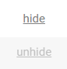
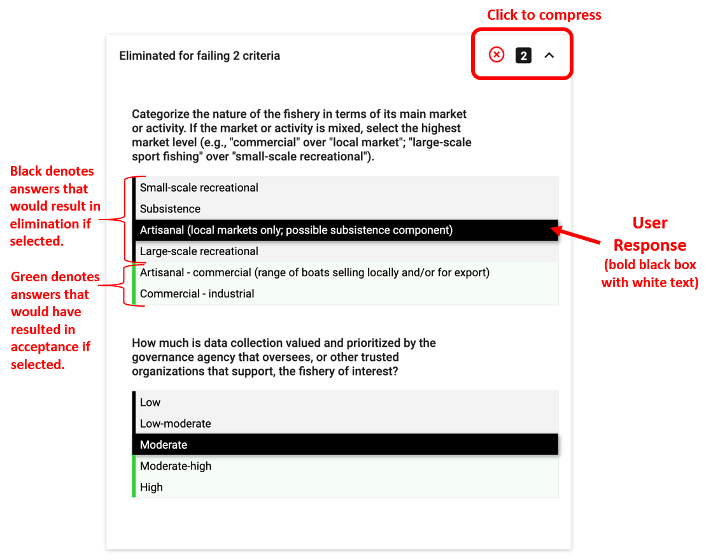
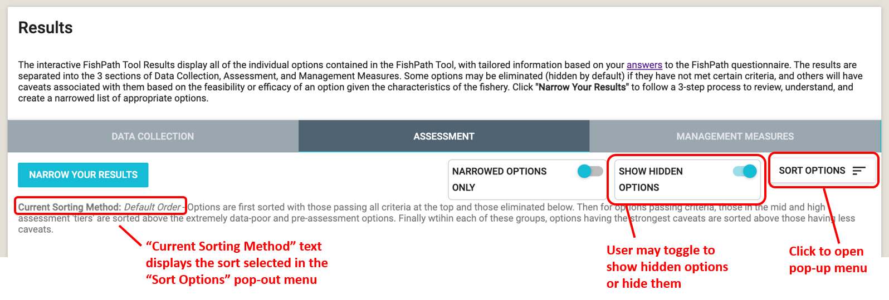
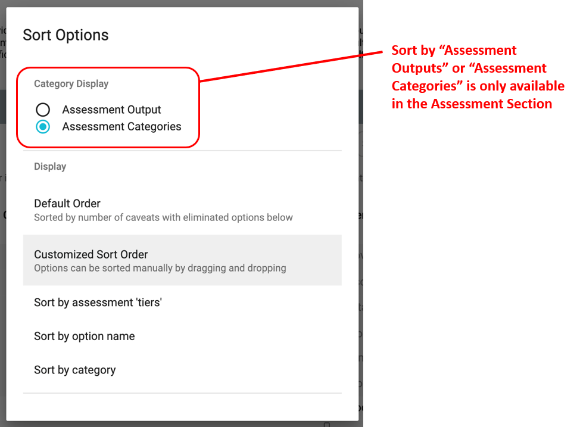
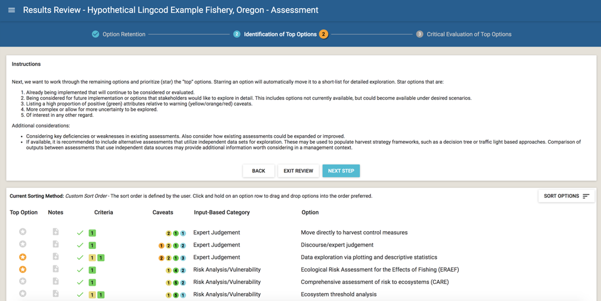

# FishPath Tool Interactive Results Page

The FishPath Tool Interactive Results Pages allow users to view and interact with all of the options contained within FishPath and understand how each option may apply to their fishery. 

Upon completion of the questionnaire for any section, the user is directed to the FishPath Tool Interactive Results page (Figure \@ref(fig:results-overview)). The results are presented separately for each of the 3 sections, or harvest strategy component: 1) Data Collection; 2) Assessment; and 3) Management Measures (Figure \@ref(fig:results-overview), sections shown in dark blue bars near top of screen). 

Each of the three sections of the results can be accessed individually without needing to complete all three sections. If a user has not completed the questionnaire in at least one of the sections, they will be prompted to return to finish the section questionnaire before accessing results (Figure \@ref(fig:summary-screen)).


```{r results-overview, echo=FALSE, fig.cap='Initial results display screen in the FishPath tool (featuring the Assessment section), displaying a snapshot of results, not a full listing.', fig.align='center', out.width='95%', fig.show='hold'}
knitr::include_graphics('images/results-overview.png')
```

Figure \@ref(fig:results-components) shows the general components of the results page. Each of these is elaborated below: 

1.	[Actions to Share Results and Edit Fishery Info]
2.	[Interactive Results Table]
3.	[Show Hidden Options and Sort Options] 
4.	[Bookmarked Questions and Influential Answers]
5.	[Results Narrowing Process]  

```{r results-components, echo=FALSE, fig.cap='Key components (red labels 1-5) of the FishPath Interactive Tool Results Page.', fig.align='center', out.width='95%', fig.show='hold'}
knitr::include_graphics('images/results-components.png')
```

## Actions to Share Results and Edit Fishery Info {#Results-Actions}

At the top of the Results Page, the user may either “Share”, “Export CSV”, "Generate PDF Report", “Copy”, or "Edit Name and Details" for their fishery (Figure \@ref(fig:results-components)). 

-	**Share:** This will generate a link that allows the user to share a fishery with someone. The user simply needs to send the link and the recipient will have view-only access to this fishery from their active account. A shared fishery can be saved under someone else’s FishPath account, and they can make a copy of it to separately edit, if needed. Tip: when creating a copy of a shared fishery in a user account, it is useful to rename the fishery so that edits are tracked under this new name.
-	**Export CSV:** This allows users to export the question and answer list from the saved questionnaire, as well as a simple results file, as a .csv file.
-	**Generate PDF Report:** Allows the user to create a .PDF of the FishPath results, with all notes captured. The PDF report provides detailed information on each option and their associated caveats and criteria related to the fishery. Users can select to see a report for the “full list” of options, or for a specified list of “top options”.
-	**Copy Fishery:** This allows users to make a copy of a fishery’s results, be these their own, or from a shared link. To rename that fishery and edit it under a different name, the user should select the “Edit Name and Details” button.
-	**Edit Name and Details:** This allows users to edit the information entered on the Fishery Information form (name, species, geography, etc.)


## Interactive Results Table
The results table lists all the available options for the section of interest in rows. Each row summarizes the criteria met and failed, and the caveats invoked (see also “Criteria and Caveat Questions” section above). Each option can be selected and expanded to view its description and results in more detail. A guide to the content contained in each row is listed below.

### Table Structure
Figure \@ref(fig:single-row) displays a single row from an example results table. The single row represents one option in the FishPath tool, and the details of this singe row are as follows:

```{r single-row, echo=FALSE, fig.cap='Headings of the FishPath tool results table.', fig.align='center', out.width='95%', fig.show='hold'}
knitr::include_graphics('images/single-row.png')
```

- **Hide/Unhide:** Any option for which one or more of its minimum criteria have not been met by the fishery is automatically “hidden” (greyed-out) by the FishPath tool. For any option, including those not meeting minimum criteria, users may manually click this link to “hide” the option, or click “hidden” or reinstate it. 

```{r hide, echo=FALSE, fig.align='center', out.width='10%', fig.show='hold'}

```

- **Notes:** As within the questionnaire, notes may be written and saved (with a secure internet connection) for each option. For example, notes may be taken on fishery-specific details (not covered within the questionnaire) on why that option may or may not be a good fit, or to record the user’s or user groups overall evaluation of the option, given its associated criteria and caveats. Alternatively, notes may be taken if options are hidden or reinstated, to justify that choice as documentation. Notes are be included in the PDF report. 

```{r notes, echo=FALSE, fig.align='center', out.width='15%', fig.show='hold'}
knitr::include_graphics('images/notes.png')
```

- **Criteria (Data Collection and Assessment sections):** The criteria column provides information on whether the fishery meets the minimum conditions required to undertake the option. As explained above, the Management Measures section does not include criteria. If the fishery has met all of the minimum criteria required for the option, a green check is displayed. On the other hand, if a fishery has not met one or more of the minimum criteria required for the option, a red X is displayed (and the option is automatically “hidden”). The numbered boxes next to the red “X” indicate the number of criteria met (green) and unmet (black). For the assessment section only, criteria also have associated “traffic light” colored (black, red, orange, yellow, green) guidance to encourage FishPath users to explicitly consider the possible uncertainty associated with the quality of their fishery’s information   (with black equating to a minimum criterion not having been met). The numbers within in each symbol, are the subset of the total criteria for that option that were not met (black), and that invoked (red, orange, yellow) uncertainty warnings, and positive attributes (green), as triggered by questionnaire responses.

```{r criteria, echo=FALSE, fig.align='center', out.width='35%', fig.show='hold'}
knitr::include_graphics('images/criteria.png')
```

- **Caveats:** The format of the caveats column is identical across all three sections. Caveats are shown as colored circles with numbers indicating the total number of questionnaire responses that invoked a caveat of that particular color. There are three types of caveats:

  1.	**Cautionary, or warning caveats:** these are marked as red, orange, and yellow circles with the severity or strength of the caveat corresponding to the color (red being highest). These give cautionary guidance based on an attribute of a fishery. For example, if the user responded that the species of interest is susceptible to barotrauma, this would invoke a red caveat against size limits as a management measure, since the fishing-induced mortality of the released (under- or over-sized) fish would render size limits ineffective.
  2.	**Positive attributes:** A green colored caveat provides reasoning for why the option might be well-suited for the fishery on the basis on a of a user response in the questionnaire.
  3.	**Static caveats:** Turquoise colored caveats are static caveats that need to be considered for an option, regardless of the fishery or the questionnaire responses. A static caveat is independent of specific fishery circumstances and as such are always present. These include key assessment assumptions, for example, that the assessment option assumes that fishery selectivity has not changed over time, or that the assessment method cannot explicitly address uncertainty.

```{r caveats, echo=FALSE, fig.align='center', out.width='35%', fig.show='hold'}
knitr::include_graphics('images/caveats.png')
```

- **(Data) Category:** The Category column allows the user to view the options by categories. This column is different for each section. In the Data Collection Section, this column is titled “Data Category”, showing the four categories of the type of data that may be collected (see also “Data Collection Section Results” above). In the Assessment Section, this column is titled either “Input-Based Category” or “Output-Based Category”, reflecting two sorting options available for organizing the assessment option results. In the Management Measures Section, this column is simply titled “Category” and displays the categories of management measures. 

- **Option:** This is the name of the option being considered.
 
### Full Option Details
 
Each row in the Results Table displays the option name with summarized results for each option. When users click on any option, a pop-up box appears, which provides full details of the option itself, together with the detail of the criteria and caveats invoked. 

First, a description of the option is provided, together with relevant references, and contact information (if available or appropriate). For the Data Collection options, the types of data that may be collected using the option are summarized. For the Assessment section, where available, links to assessment packages are provided.

Next, the invoked criteria and caveats are summarized by (Figure \@ref(fig:opt-desc))

- Criteria not met,
-	Met criteria,
-	Cautionary caveats,
-	Positive attribute caveats, and
-	Static caveats 

Next to each, there are individual drop-down menus where the user can find the specific detail on each individual criterion and caveat, along with the question and response that invoked the criterion or caveat.
 
```{r opt-desc, echo=FALSE, fig.cap='Example of pop-up box that appears when clicking on each option.', fig.align='center', out.width='50%', fig.show='hold'}
knitr::include_graphics(c('images/option-description.png', 'images/option-result-details.png'))
```


**Criteria drop-down box (Figures \@ref(fig:crit-drop-down)-\@ref(fig:assessment-crit-drop-down))**: Each criterion drop-down shows the relevant question with the user’s response shown (highlighted in black) relative to the minimum required level for that option (where green coloring starts on left) (Figure \@ref(fig:crit-drop-down)). The Assessment section assigns traffic light colors to levels above the minimum, indicating their relative uncertainty and thus the relative caution that should be taken (Figure \@ref(fig:assessment-crit-drop-down)).

```{r crit-drop-down, echo=FALSE, fig.cap='Example drop-down menu with details for an option in the Data Collection section that was eliminated for failing two criteria. The bold, black box and white text indicates the user answer to the question. The black answer options indicate those that result in elimination if selected. The green answer options indicate those that would have resulted in acceptance if selected.', fig.align='center', out.width='75%', fig.show='hold'}

```

```{r assessment-crit-drop-down, echo=FALSE, fig.cap='Example drop-down menu with details for an option in the Assessment section that has passed criteria, but indicating the user to take caution regarding the uncertainty in the fishing effort data. Red indicates high uncertainty in the data. Green indicates low uncertainty.', fig.align='center', out.width='75%', fig.show='hold'}
knitr::include_graphics('images/assessment-crit-drop-down.png')
```

**Caveat Drop-Down Box (Figures \@ref(fig:cav-drop-down)-\@ref(fig:static-cav-drop-down))**: Each individual caveat box displays the FishPath question with the user’s answer in grey text, followed by caveat text related to the use of the option in the fishery in the context of that particular question response. The color of each box reflects the caveat color (see caveat descriptions above): cautionary caveats shaded yellow, orange or red; positive attributes shaded green; and static caveats shaded in turquoise.

```{r cav-drop-down, echo=FALSE, fig.cap='Example caveat drop-down menu with details for an option for which questionnaire responses invoked 8 cautionary caveats (2 orange, 6 yellow, as shown at the top right corner of the drop-down menu).', fig.align='center', out.width='75%', fig.show='hold'}
knitr::include_graphics('images/cav-drop-down.png')
```

```{r pos-attr-drop-down, echo=FALSE, fig.cap='Example drop-down menu of positive attributes for an option for which questionnaire responses invoked 5 positive attributes (shown at the top right corner of the drop-down menu).', fig.align='center', out.width='75%', fig.show='hold'}
knitr::include_graphics('images/pos-attr-drop-down.png')
```

```{r static-cav-drop-down, echo=FALSE, fig.cap='Example static caveat drop-down menu for an option with 3 static caveats (shown at the top right corner of the drop-down menu). Each individual static caveat box displays grey text to note “This caveat always applies to this option”, and a short explanation of the static caveat.', fig.align='center', out.width='75%', fig.show='hold'}
knitr::include_graphics('images/static-cav-drop-down.png')
```

### More Information on Options within the 3 Results Sections

#### Data Collection Section Results
The Data Collection section of the FishPath tool includes a range of data collection options (from market surveys, to logbooks and observer programs). These data collection options are subdivided according to the broad category of data that may be collected, as these influence the viability of the data collection option. The four data categories in the FishPath tool are: 1) biological information; 2) data that yield a basic understanding of the fishery; 3) data that can inform temporal trend analyses (data time series), and 4) data that are of a sufficient quality to inform a model-based stock assessment.

#### Assessment Section Results
The Assessment section of the FishPath tool allows the user to understand which data-limited stock assessment methods are available and best suited to their fishery. In the FishPath tool, an assessment is defined as any analysis or performance indicator that gives useful information for management by direct or indirect measures of stock status. This could range from a “cause for concern” arising from expert judgement, qualitative risk assessments, values of empirical indicators relative to pre-defined trigger levels, multiple indicator frameworks, to life history analyses that provide estimates of fishing mortality, F, or fishing mortality at maximum sustainable yield FMSY, catch-only models, size or length based approaches, to population dynamics model-fitting approaches that estimate biomass.

#### Management Measure Section Results
A management measure is the form of control used to manage the fishing mortality. Once the desired management measures have been identified (for example, size limits, or catch adjustments in response to quantitative assessment outcomes), they are adjusted via “decision rules”, or “harvest control rules”. These specify the strength and nature of the pre-agreed management action to be taken given the status of the fishery, as determined by the assessment. Management measures can take many forms including spatial, temporal, effort, catch, and gear related restrictions. The FishPath tool does not have any minimum criteria listed for management measures, but instead uses cautionary caveats. Multiple management measures can and should be used together. The FishPath tool results do not prescribe or give guidance on the specific form of the harvest rule, nor the strength of adjustment in response to assessment outcomes. However, the FishPath tool does direct users to resources and tools that can support in this process, located within the description of each option.


## Show Hidden Options and Sort Options

The “Show Hidden Options” Toggle (Figure \@ref(fig:show-hidden-sort)) allows users to display or not display those options that have been “hidden” (greyed out) in the results table. When shown, “hidden” options will appear in grey. 

```{r show-hidden-sort, echo=FALSE, fig.cap='Results page with the “Show Hidden Options” Toggle and “Sort Options” in a red circle.', fig.align='center', out.width='75%', fig.show='hold'}

```

The “Sort Options” functionality allows the user to arrange and view the options in different ways. This does not affect the results or shortlisting of options; it is merely a means to organize and display the results.

After clicking “Sort Options”, a pop-up box (Figure \@ref(fig:filter-and-sorting)) appears with the ability to sort the options by: 

- In the Assessment section only, there is an additional option to sort by two categories: “Output-Based Category” (i.e., according to the general type of output generated by the assessment method or option); or “Input-Based Category” (i.e., according to the main form of input required by the assessment or option).
-	**Default Order:** The default sort is to list all options that did not meet minimum criteria at the bottom (automatically greyed out as hidden options), with the options for which the highest number of cautionary caveats were invoked at the top for review.
-	**Customized Sort Order:** This maintains the current sort order but allows users to return to the results table and “drag and drop” options into the preferred order. 
-	**Sort by option name:** Sorts options alphabetically by option name.
-	**Sort by category:** Sorts options alphabetically by category name. For the Assessment section, users first select the Category Display that they want to display and sort by.

Clicking a Sort option automatically sorts the options on the screen. After making selections on the Sort window, users can click outside of the pop-up onto the results table to return to the results.
The current sort selected is shown at the top of the results table at “Current Sorting Method” (Figure \@ref(fig:show-hidden-sort)). 

```{r filter-and-sorting, echo=FALSE, fig.cap='Sort Options pop-up box.', fig.align='center', out.width='50%', fig.show='hold'}

```

## Bookmarked Questions and Influential Answers
If the user scrolls to the bottom of the results screen (below results table), they are provided with a summary list of the questions bookmarked by the user, together with a list of “Influential Answers ”, and, finally, a “See All Answers” link. 

### Bookmarked Questions
All questions that were “bookmarked” during the questionnaire will be listed here (Figure \@ref(fig:flagged-questions)). Users can select each question to get a detailed list of all caveats invoked or criteria not met based on the response.  Users can also select each question to change the answer, add notes, or remove bookmark. It is highly recommended to review these questions and invoked caveats so that users can update their response or provide more detailed notes on the response, based on seeing how the response impacts results.

```{r flagged-questions, echo=FALSE, fig.cap='List of bookmarked questions.', fig.align='center', out.width='95%', fig.show='hold'}
knitr::include_graphics('images/flagged-questions.png')
```

### Influential Answers
The “Influential Answers” list is a summary of the questions and user responses that invoked the most eliminating criteria (by number), together with the number of caveats and criteria invoked, by assigned traffic light color (Figure \@ref(fig:influential-answers)). The caveats invoked by the question are displayed (color strength and number) to its left. 

It is recommended to review this list prior to entering the results narrowing process (described below), to better understand some of the key challenges facing the fishery. Users can select any question on this list to change an answer, add notes to the question, and see a list of all impacted options and their associated caveats (Figure \@ref(fig:influential-answers-expanded)).

```{r influential-answers, echo=FALSE, fig.cap='List of influential answers.', fig.align='center', out.width='95%', fig.show='hold'}
knitr::include_graphics('images/influential-answers.png')
```

```{r influential-answers-expanded, echo=FALSE, fig.cap='Impacted options for a question.', fig.align='center', out.width='75%', fig.show='hold'}
knitr::include_graphics('images/influential-answers-expanded.png')
```

At the bottom of these lists, there is a link to “See All Answers” (as well as at the top of the results screen under “Answers”).  These links take users to a full list of answers from each section, showing all information, including the number of caveats invoked, and any bookmarked questions. This is a good resource for users wanting to review the questionnaire responses for a fishery. Answers may also be changed and notes added, which update after clicking “Save”.

## Results Narrowing Process {#Results-Narrowing}
Typically, the FishPath questionnaire process results in a long list of potential options that are presented to the user. The challenge is to then refine this to a workable shortlist of options that can be reviewed in further detail, and around which a draft harvest strategy can be developed. This can be a daunting task, given the number of options, and the large amount of detail around the criteria and caveats invoked against each. As such, the Results Review provides guidance as to how to undertake the task of narrowing the list of viable harvest strategy components. 

The Results Narrowing process prompts the user through a series of steps to further refine and narrow the options for their fishery, and to consider detail about the application of each option in the fishery. The goal is to finish with a short list of defensible, appropriate and documented options for the fishery. 

First, the user accesses the Results Narrowing process by selecting the “Review Top Options” button located above the Results Table in the Results Screen. (See Figure \@ref(fig:results-overview))

After clicking on “Review Top Options”, the user is directed to a step-wise results review process (Figure \@ref(fig:results-review)). Each step of the results review process contains an “Instructions” box with clear steps, as well as the ability to access different steps of the results review process through “Back”, “Exit Review” and “Next Step” (Figure \@ref(fig:results-review)). Across the top of the page, the user views steps in the process:

```{r results-review, echo=FALSE, fig.cap='Overview of the FishPath Tool results screen and results review process.', fig.align='center', out.width='95%', fig.show='hold'}
knitr::include_graphics('images/results-review.png')
```

The narrowing process (done as a group exercise or by independent users), consists of the following major steps:

1.	**Option Retention (Figure \@ref(fig:review-step-1)):** The goal of the first step is to hide all options that are clearly not viable for the fishery due to failure to meet minimum criteria, logistical, political, or other major reasons. Users should carefully review the list to hide these options, as well as un-hide options that they want to reinstate. Specific instructions are included on the screen in this step of the process, including questions to consider as narrowing the list.

```{r review-step-1, echo=FALSE, fig.cap='Step 1, Option Retention, in the results review process.', fig.align='center', out.width='95%', fig.show='hold'}
knitr::include_graphics('images/review-step-1.png')
```

2.	**Identification of Top Options (Figure \@ref(fig:review-step-2)):** In this step, users review each remaining option to identify a short list of starred options that will be seriously considered and explored in more detail. Users should familiarize themselves with the sorting feature and the influential answer list (see above) to facilitate this process. When comparing options, users should compare the number of cautionary caveats and criteria, their relative strength, and the ratio of cautionary caveats to positive attribute caveats. Specific instructions are included on the screen in this step of the process.

```{r review-step-2, echo=FALSE, fig.cap='Step 2, Identification of Top Options, in the results review process.', fig.align='center', out.width='95%', fig.show='hold'}

```

3.	**Critical Evaluation of Top Options (Figure \@ref(fig:review-step-3)):** In the final step, users can more critically evaluate the top options by considering each criterion and caveat in complete detail, and, potentially, ranking the options in order of potential. To facilitate this process, users can export a report that lists the top options and all of their details. 

```{r review-step-3, echo=FALSE, fig.cap='Step 3, Critical Evaluation of Top Options, in the results review process.', fig.align='center', out.width='95%', fig.show='hold'}
knitr::include_graphics('images/review-step-3.png')
```