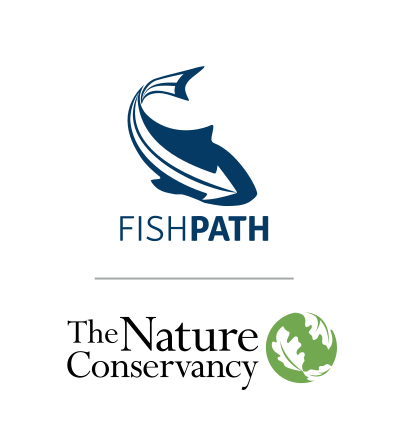

--- 
title: "FishPath Tool User Guide"
author: "The Nature Conservancy"
date: "`r Sys.Date()`"
output:
  html_document:
    df_print: paged
  pdf_document: default
  word_document: default
description: ''
documentclass: book
link-citations: yes
bibliography:
- book.bib
- packages.bib
site: bookdown::bookdown_site
biblio-style: apalike
fontsize: 11pt
---

#   {-}

```{r, echo=FALSE}
colorize = function(x, color){
  if (knitr::is_latex_output()) {
    sprintf("\\textcolor{%s}{%s}", color, x)
  } else if (knitr::is_html_output()) {
    sprintf("<span style='color: %s;'>%s</span>", color, x)
  } else x
}
```

`r colorize("Initial version for feedback", "red")`

```{r logo, echo=FALSE, fig.align='center', out.width='75%', fig.show='hold'}

```
